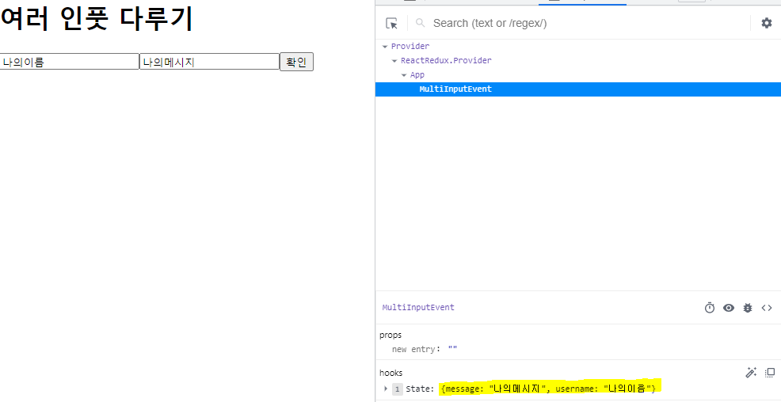

# 2주차 React 스터디 정리

| 장   | 제목          |
| ---- | ------------- |
| 4장 | 이벤트 핸들링 |
| 5장 | ref: DOM에 이름 달기 |

## 4장

### 4.1 리액트의 이벤트 시스템

리액트의 이벤트 시스템은 HTML과 유사한 방법입니다만 아래의 주의 점이 있습니다

#### 1. 이벤트 이름은 카멜 표기법으로 작성합니다
#### 2. 이벤트에 실행할 JS 코드를 전달하는 것이 아닌 `함수 형태의 값`을 전달합니다
```javascript
// 에러! 직접 실행 코드를 넣으면 안된다
<div onClick={alert('hello world!')} />

// 함수 형태로 전달하자
<div onClick={ () => alert('hello world!') } />

// 혹은 렌더링 전 미리 정의해서 사용할 수 있다
const ClickEvent = () => { alert('hello world!') } // 렌더링 전 미리 정의
return(
  <div onClick={ClickEvent} /> // 정의한 함수를 불러와 실행한다
);
```
#### 3. DOM 요소에만 이벤트를 설정할 수 있습니다
`div` `button` `input` `form` 등 DOM 요소에만 이벤트 설정이 가능하고 `컴포넌트`에는 이벤트를 설정할 수 없습니다
```javascript
// DOM 요소에는 이벤트 설정 가능
<div onClick={() => alert('hello world!')}>click me!</div> 

// 컴포넌트에는 불가능
<MyComponent onClick={ClickEvent}> // onClick 이라는 props를 MyComponent에 전달한다는 뜻이 된다
```

### 4.2 예제로 이벤트 핸들링 익히기

#### input 값이 바뀔 때마다 state 값이 변경되는 이벤트
```javascript
import { useState } from "react";

const Other = () => {
  const [value, setValue] = useState("");
  
  // 이벤트 함수
  const changeEvent = (e) => {
    setValue(e.target.value); // target.value를 읽어 해당 값으로 setState한다
  };
  
  return (
    <>
      <h1>input 이벤트</h1>
      <input
        type="text"
        placeholder="input here"
        onChange={changeEvent} {/* input 값이 바뀔 때마다 changeEvent를 실행한다 */}
        value={value} {/* value 값은 value State */}
      />
    </>
  );
};

export default Other;
```

### 여러 input을 한번에 다루기

각각 input 마다 state와 event메서드를 모두 설정할 수도 있지만 input이 많아지면 복잡해지기도 합니다

그래서 아래처럼 하나의 이벤트 메서드로 여러 input을 다루는 방법도 있습니다

```javascript
import { useState } from "react";

const MultiInputEvent = () => {
  // form에는 username과 message라는 state가 존재
  const [form, setForm] = useState({
    // form은 여러 값을 입력받아야 되니 객체 형태로 작성한다
    username: "",
    message: "",
  });
  // form가 가지고 있는 state를 정의
  const {username, message} = form;

  const onChange = (e) => {
    const nextForm = {
      ...form, // 기존 form 복사 (이전에 입력한 내용을 그대로 이어받기 위해)
      
      // name으로 어디 state를 업데이트 할지 결정하고 해당 state의 내용을 value로 설정
      [e.target.name]: e.target.value,
    };
    setForm(nextForm);
  };

  const onClick = () => {
    alert(`${username}: ${message}`);
    setForm({
      username: "",
      message: "",
    });
  };

  return (
    <>
      <h1>여러 인풋 다루기</h1>
      {/* input마다 name을 설정해 어떤 state인지 명시하기 */}
      <input
        type="text"
        placeholder="username"
        name="username"
        value={username}
        onChange={onChange}
      />
      <input
        type="text"
        placeholder="message"
        name="message"
        value={message}
        onChange={onChange}
      />
      <button onClick={onClick}>확인</button>
    </>
  );
};
export default MultiInputEvent;
```

이미지 우측 하단에 보면 `username` `message` state에 정상적으로 값이 업데이트 된 것을 확인할 수 있습니다

## 5장

### 5.1 ref는 어떤 상황에서 사용해야 할까?

ref는 DOM에 이름을 달때 사용하는 방법입니다

그럼 리액트에서는 컴포넌트에 id를 사용하면 안될까요?

책에서는 id를 사용해도 되지만 최대한 `권장하지 않는` 방법입니다

왜냐하면 id는 `유일` 해야하는데 id를 부여받은 컴포넌트가 여러개 생성된다면 같은 id의 `유일성`이 깨지기 때문이라고 합니다

만약 불가피하게 id를 사용해야 하는 경우라면 id 뒷부분에 추가 텍스트를 붙여 중복 id를 방지합니다
```javascript
// 중복 id 방지를 위해 overlapId 라는 id 뒤에 button1이라는 텍스트 추가
<MyComponent id='overlapId button1' />
```

#### 주로 ref는 `DOM을 꼭 직접 건드려야할 때` 사용합니다

- 특정 input에 포커스 주기
- 스크롤 박스 조작하기
- canvas 요소에 그림 그리기 등

### 5.2 ref 사용

ref를 만드는 방법은 두가지가 있습니다

- 콜백 함수를 통한 ref
```javascript
// this.input = input DOM을 가르킴
<input ref={(ref)=>{this.input=ref}} />
```

- createRef를 통한 방법
```javascript
// 리액트에 내장된 createRef 함수를 사용
import { Component } from 'react';

class RefSample extends Component {
  input = React.createRef(); // ref생성
  handleFocus = () => {
    this.input.current.focus();
  }
  
  render() {
    return (
      <div>
        /* input에 ref 설정, 위에 방법보다 좀 더 간결해졌다 */
        /* ref에 대한 접근은 this.input.current로 조회 가능하다 */
        <input ref={this.input} />
      </div>
    )
  }
}

export default RefSample;
```

### 5.3 컴포넌트에 ref 달기

아래 코드는 책 5.3 코드를 `함수형 컴포넌트`로 작성한 코드입니다

```javascript
import { useRef } from "react";

const ScrollBox = () => {
    // ref를 쓰기 위해 Hooks를 선언한다
    const boxRef = useRef();

    const style = {
        border: '1px solid black',
        height: '300px',
        width: '300px',
        overflow: 'auto',
        position: 'relative',
    };

    const innerStyle = {
        width: '100%',
        height: '650px',
        background: 'linear-gradient(white,black)',
    };
    
    // ref.current로 DOM의 정보를 조작한다
    // 이때 현재 ref의 scroll 위치를 맨 아래로 설정시킨다
    const scrollToBottom = () => {
        boxRef.current.scrollTop =  boxRef.current.scrollHeight -  boxRef.current.clientHeight;
    }

    return(
        <>
        <div
            style={style}
            ref={boxRef} /* ref 설정 */
        >
            <div style={innerStyle} />
        </div>
        <button onClick={scrollToBottom}>이동</button>
        </>
    );
}
export default ScrollBox;
```

조작한 박스(DOM)에 ref를 설정해주고 버튼을 클릭할 때마다 ref가 설정된 DOM을 조작하는 예시입니다

중요한 부분이라면 `const scrollToBottom`에 있는 `.current`를 주의하시면 좋을 것 같습니다

앞서 말했듯 ref를 조작하기 위해선 반드시 (ref이름).current로 조작해야합니다
