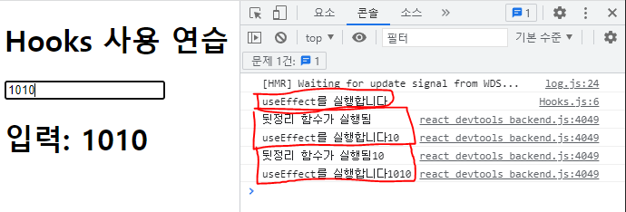

# 3주차 React 스터디 정리

| 장   | 제목          |
| ---- | ------------- |
| 6장 | 컴포넌트 반복 |
| 7장 | 컴포넌트와 라이프사이클 메서드 |
| 8장 | Hooks |

## 6장

### 6.1 자바스크립트 배열의 map() 함수

코드의 반복을 피하기 위해 우리는 반복문을 사용하는데 리액트에서는 `map` 함수를 통해 컴포넌트의 반복을 할 수 있습니다

`map` : 파라미터로 전달된 함수를 사용해 배열 내 각 요소를 원하는 규칙에 따라 변환 후 그 결과로 새로운 배열을 생성

```javascript
array.map(callback, [thisArg])
```

이제 이 것을 하나하나 알아봅시다

- `array`: map 함수를 실행하고 싶은 원본 배열을 지정해줍니다
- `callback`: 새로운 배열 요소를 생성하는데 아래 세 가지 파라미터를 가질 수 있습니다
    - `currentValue`: 현재 처리하고 있는 요소
    - `index`: 현재 처리하고 있는 요소의 index 값
    - `array`: 현재 처리하고 있는 원본 배열
-   `thisArg`: (선택적으로 쓰는 항목입니다) callback 함수 내부에서 사용할 this 레퍼런스

이를 적용하자면

```javascript
// ES6 문법 (function으로 할 수도 있습니다)
const nums = [1, 2, 3, 4, 5]
const result = nums.map(num => num*num);

// 출력 = [1, 4, 9, 16, 25]
```
<br />

### 6.2 데이터 배열을 컴포넌트 배열로 변환하기

그럼 이 반복문을 실제 프로젝트에서는 어떻게 쓰일까요?

아래 코드는 실제 프로젝트에서 map을 이용해 컴포넌트 반복을 처리한 예시입니다

```javascript
// map을 이용할 array
const plays = [
{
  id = 1
  name = name1
  value = hello world!
},
{
  id = 2
  name = name2
  value = web front end study
},
{
  id = 3
  name = name3
  value = react is most popular framework(or library)
},
]

// Plays 컴포넌트 안에 play를 map 함수로 반복해줌
<Plays>
  {plays &&
    plays.map((play) => (
    // key 라는 값이 있다 이것을 유의하자
    <Link href={`/plays/${play.id}`} key={play.id}>
      <a><PlayComponent play={play} /></a>
    </Link>
  ))}
</Plays>

// plays 배열에 값이 있을 때 map 함수를 실행합니다
// 현재 처리하고 있는 play 요소가 반복 될 때마다 PlayComponent를 반복합니다
// 이때, play라는 값을 PlayComponent에 play라는 props로 전달해줍니다
```
<br />

### 6.3 key

`6.2`코드에 적용시킨 것을 보면 특이한 점을 발견할 수 있습니다

#### 바로 `key`라는 값이 있다는 것인데요 `key`값은 왜 있을까요?

<br />

예를들어 우리는 10번째로 쓴 내용을 삭제하고 싶다 가정해봅시다

그럼 내용를 삭제하려고 하는데 어느 것이 10번째로 쓴 내용일까요?

누구는 아래서부터 10번째라 답할거고 누구는 위에서 10번째라 답할 것입니다 다 제각각이죠

이런 문제를 해결하기 위해 일종의 `인식표`와 같은 역할을 하는 것이 `key`입니다

`key`는 `인식표`와 같은 역할을 해야하기 때문에 key에 들어갈 수 있는 값은 반드시 `유일`해야합니다

이 점을 유의하고 다시 위에 올라가 `key={play.id}`를 보면 왜 key를 지정했는지 이해가 가실겁니다

<br />

`key`값을 정하는 방법은 두 가지가 있습니다
- index
- 사용자가 만든 고유 번호

`index`는 map 함수에 전달되는 콜백 함수의 인수입니다 (map함수의 구조에서 나왔었음)

index는 보통 key 값으로 쓰기에 `추천하지 않는` 방법입니다 배열 변경 시 효율적으로 리렌더링하지 못하기 때문이죠

때문에 컴포넌트에 고유 번호가 없을 때 사용합니다

`사용자가 만든 고유 번호`는 보통 `id`를 지정해 많이 사용합니다 `id`에 대한 것은 `6.4`에서 어떻게 다루는지 볼 수 있습니다

<br />

### 6.4 응용

<details markdown="1">
<summary>응용 코드 예시</summary>

```javascript
import { useState } from 'react'

const MapEvent = () => {
    // 초기 배열
    const [names, setNames] = useState([
        { id: 1, text: '학생1'},
        { id: 2, text: '학생2'},
        { id: 3, text: '학생3'},
    ]);
    
    // 입려하고 있는 내용의 id를 지정해주기 위한 state
    const [nextId, setNextId] = useState(4)
    
    // 입려하고 있는 내용의 text를 받기 위한 state
    const [nextText, setNextText] = useState('')

    const onChange = e => {
        setNextText(e.target.value)
    }
    
    // 새로운 내용 삽입 이벤트
    const onClick = () => {
        // 기존 배열에 항목을 추가 하기 위해 기존 내용을 복사한다
        const nextName = names.concat({
            // id 값과 text 값을 부여한다
            id: nextId,
            text: nextText
        });

        // 새롭게 만들어진 배열을 기존 배열과 바꿔준다
        setNames(nextName)
        setNextId(nextId + 1) // 다음 id를 위해 증가
        setNextText('') // input 값을 초기화
    }
    
    // 삭제 이벤트
    const onRemove = id => {
        // filter로 name.id != id 인 요소만 return
        const nextName = names.filter(name => name.id !== id)
        setNames(nextName)
    }
    
    return(
        <>
        <h1>값을 추가해보세요</h1>
        <input
            placeholder='input name here!'
            value={nextText}
            onChange={onChange}
        />
        <button onClick={onClick}>등록</button>
        <ul>
            {/* map 함수로 names 배열을 돌아준다 */}
            {names.map(name => <li key={name.id} onDoubleClick={() => onRemove(name.id)}>{name.text}</li>)}
        </ul>
        </>
    );
}

export default MapEvent;
```

</details>

<br />

## 7장

모든 컴포넌트는 렌더링 되기 전인 준비 과정 ~ 페이지에서 사라지는 과정까지 `라이프사이클`을 가지고 있습니다

이런 `라이프사이클` 중간 중간 특정 행동을 하고싶을 때 `라이프사이클 메서드`를 사용합니다

예를들어 처음 렌더링 시 해야할 작업 처리, 업데이트가 될 때마다 할 작업, 불필요한 업데이트 방지 등 여러 작업이 있습니다

### 7.1 라이프사이클 메서드의 이해

라이프사이클 메서드는 `클래스형` 컴포넌트에서 사용 가능한 방법입니다 

때문에 이 장은 기본적인 방법에 대한 것만 빠르게 짚고 넘어가고 `8장`에서 Hooks를 이용한 방법으로 더 깊이 다뤄보겠습니다

📌`Will`이 붙어있다 → 특정 작업 `전` 실행하는 메서드, `Did`가 앞에 붙어있다 → 특정 작업 `후` 실행하는 메서드

먼저 라이프사이클은 `세 가지` 상태가 있습니다 
- `마운트`: DOM이 생성되고 브라우저에 나타나는 순간

    > constructor: 컴포넌트 새로 만들 때마다 호출 <br />
    > getDerivedStateFromProps: props에 있는 값을 state에 넣음 <br />
    > render: UI를 렌더링

- `언마운트`: DOM이 브라우저에서 제거되는 순간

    > componentWillUnmount: 컴포넌트가 브라우저에서 사라지기 전 호출
    
- `업데이트`: 특정 값이 변해 리렌더링되는 순간
    > getDerivedStateFromProps: props 변화에 따라 state 값에도 변화를 주고 싶을 때 <br />
    > shouldComponentUpdate: 컴포넌트가 리렌더링 되어야 할지 말지 결정 <br />
    > getSnapshotBeforeUpdate: 컴포넌트 변화를 DOM에 반영하기 전에 호출 <br />
    > componentDidUpdate: 컴포넌트 업데이트 작업이 끝난 후 호출

#### 📌 `업데이트` 발생 조건은 아래의 내용을 꼭 기억해야 합니다
- Props가 바뀔 때
- State가 바뀔 때
- 부모 컴포넌트가 리렌더링될 때
- forceUpdate로 강제 렌더링을 시킬 때

<br />

### 7.2 라이프사이클 메서드 살펴보기

- `render()`
    - 컴포넌트 모양새를 정의, 필수 메서드이다 props와 state에 접근할 수 있습니다
    - 단, render 안에서는 이벤트 설정이 아닌 곳에서 setState와 DOM 접근을 하면 안된다
    
- `constructor`
    - 컴포넌트의 `생성자` 메서드로 초기 state를 정합니다
    
- `getDerivedStateFromProps`
    - props로 받아온 값을 state에 동기화시키는 용도로 사용ㅎ바니다
   
-  `componentDidMount`  
    - 다른 라이브러리나 프레임워크를 호출하거나 이벤트를 등록, 비동기 작업 등을 처리합니다
    
- `shouldComponentUpdate`
    - props나 state 변경 시 리렌더링 여부를 결정합니다
    - `true`와 `false` 값을 리턴하며 `false` 시 업데이트 과정이 중지됩니다
    - 리렌더링 성능 최적화를 해야할 때 사용합니다
    
- `getSnapshotBeforeUpdate`
    - `render`에 의해 만들어진 결과물이 브라우저에 실제 반영 되기 직전 호출됩니다

- `componentDidUpdate`
    - 리렌더링 완료 후 실행하며 DOM 관련 처리를 해도 무방합니다
    - `prevProps` 혹은 `prevState`를 사용해 이전 데이터에 접근할 수 있습니다
    
- `componentWillUnmount`
    - 컴포넌트를 DOM에서 제거할 때 실행합니다
 
- `componentDidCatch`
    - 렌더링 도중 에러 발생시 오류 UI를 보여줄 수 있게 해줍니다

<br />

## 8장

### 8.1 useState

가장 `기본적인` Hook으로, 리액트의 `상태`를 관리하는 Hook입니다

```javascript
import { useState } from 'react';

// state와 세터함수를 받는다, 초기값은 0
const [value, setValue] = useState(0);

return (
    <>
        <p>현재 값 {value}</p> {/* value state를 렌더링 */}
        <button onClick={() => setValue(value + 10)>10 더하기</button> {/* 클릭시 세터함수 실행 */}
    </>
);
```

📌 useState는 한번에 한 값만 관리할 수 있습니다 만약, 여러 state를 하나의 useState에 사용하고 싶다면 [4.2 여러 input 다루기](../2주차/배한조.md)를 참고해주세요

<br />

### 8.2 useEffect

useEffect는 `컴포넌트가 렌더링될 때마다` 특정 작업을 수행하도록 설정할 수 있는 Hook입니다

```javascript
import { useState, useEffect } from 'react'

const Hooks = () => {
    const [name, setName] = useState('')
    
    // name state에 의해 컴포넌트가 리렌더링 될 때 useEffect로 아래 작업을 실행
    useEffect(() => {
        console.log('useEffect에 의해 출력됨')
        console.log(name)
    });
    const onChange = e => {
        setName(e.target.value)
    }
    return(
        <>
            <h1>Hooks 사용 연습</h1>
            <input
                name='name'
                onChange={onChange}
            />
            <h1>입력: {name}</h1>
        </>
    );
}

export default Hooks
```

#### `마운트`될 때만 useEffect를 실행할 수 있습니다

```javascript
useEffect(() => {
    console.log('마운트 됐습니다!');
},[]); // 두번째 파라미터에 빈 배열을 넣는다
```

#### 이를 응용해 `특정 값`이 변경 됐을 때만 useEffect를 실행할 수 있습니다

```javascript
useEffect(() => {
    console.log('name이 변경될 때만 useEffect를 실행합니다');
},[name]); // 두번째 파라미터에 검사를 할 값을 입력합니다
```

#### 컴포넌트가 언마운트 되거나 업데이트 되기 직전 특정 작업을 수행하고 싶다면 `뒷정리 함수`를 반환해야합니다

```javascript
useEffect(() => {
        console.log('useEffect를 실행합니다' + name);
        return () => { // 뒷정리 함수 실행
            console.log('뒷정리 함수가 실행됨'+ name);
        };
    },[name]); // 만약, 언마운트가 될 때만 뒷정리 함수를 실행하고 싶다면 두번째 파라미터는 빈 배열을 넣는다
```

위의 코드를 실행하면 뒷정리 함수는 이전에 있던 값을 출력하게됩니다

이는 `뒷정리 함수`에 의해 name이 업데이트 되기 `직전` name 값을 읽어 실행하기 때문입니다



<br />

### 8.3 useReducer

간단하게 useState보다 더 다양하게 상황에 따라 다른 값으로 업데이트 해주는 Hooks입니다

useReducer는 `현재 상태`와 `action`값을 전달받아 새로운 상태를 반환하는데 반드시 `불변성`을 지켜줘야합니다

```javascript
import { useReducer } from 'react'

// 리듀서 함수(아래 useReducer의 첫번째 파라미터와 이름을 일치시킨다)
const myReducer = (state, action) => {
    switch (action.type) { // action type에 따라 다른 값 변경
        case 'INCREMENT':
            return { number: state.number + 1}; // 증가면 number += 1
        case 'DECREMENT':
            return { number: state.number - 1}; // 감소면 numbe -= 1
        default:
            return state;
    }
}

const Hooks = () => {
    // 리듀서 Hook 선언
    // 첫 번째 파라미터: 리듀서 함수를 넣는다(함수 이름은 아무거나 해도 상관없음)
    // 두 번째 파라미터: 리듀서의 초기값 (현재 초기값은 0이다)
    const [state, dispatch] = useReducer(myReducer, { number: 0 })

    return(
        <>
            <h1>Hooks 사용 연습</h1>
            {/* <input
                name='name'
                onChange={onChange}
            />
            <h1>입력: {name}</h1> */}
            <p>현재 값은 {state.number}</p>
            
            {/* 꼭 type일 필요 없다 */}
            <button onClick={() => dispatch({type: 'INCREMENT'})}>+ 1</button>
            <button onClick={() => dispatch({type: 'DECREMENT'})}>- 1</button>
        </>
    );
}

export default Hooks
```

<br />

### 8.4 useMemo

useMemo도 역시 연산 최적화에 쓰이는데 렌더링하는 과정에서 `특정 값이 변경` 되었을 때만 연산을 실행하고 원하는 값이 바뀌지 않았다면 연산 결과를 다시 사용합니다

<details markdown="1">
<summary>예제 </summary>

```javascript
import { useState, useMemo } from 'react'

// 평균값 구하는 연산
const getAverage = numbers => {
    console.log('값 변경됨 연산 실행')
    if (numbers.length === 0) return 0
    const sum = numbers.reduce((a,b) => a + b);
    return sum / numbers.length;
}

const Hooks = () => {
    const [list, setList] = useState([])
    const [number, setNumber] = useState(''); // 주의) 문자열로 받는다

    const onChange = e => {
        setNumber(e.target.value);
    }
    const onInsert = () => {
        // 이전 리스트에 number를 추가한다(이때, number는 문자열이니 int로 형변환을 시킨다)
        const nextList = list.concat(parseInt(number))
        setList(nextList)
        setNumber('');
    }

    // useMemo 선언
    // list 값이 다르면 getAverage를 실행한다
    // 같다면 이전에 연산했던 list를 그대로 가져온다
    const avg = useMemo(() => getAverage(list), [list])

    return(
        <>
            <h1>Hooks 사용 연습</h1>
            <div>
                <input value={number} onChange={onChange} />
                <button onClick={onInsert}>등록</button>
                <ul>
                    {list.map((value, index) =>(
                        <li key={index}>{value}</li>
                    ))}
                </ul>
                <p>평균값: {avg}</p>
            </div>
        </>
    );
}

export default Hooks
```
</details>

<br />

### 8.5 useCallback

`useCallback`은 `useMemo`와 비슷한 렌더링 성능을 최적화 하는 용도로 사용합니다

[그럼 이 둘은 어떤 차이가 있을까요?](https://velog.io/@ashnamuh/React%EC%9D%98-useReducer-useCallback-useMemo-%EC%A0%9C%EB%8C%80%EB%A1%9C-%EC%95%8C%EA%B3%A0-%EC%82%AC%EC%9A%A9%ED%95%98%EA%B8%B0)

갇단하게 정리히자면 아래와 같습니다
- `useCallback`: `함수`를 반환
- `useMemo`: `값`을 반환

다만, 이 둘은 `메모이제이션`용 메모리가 추가로 요구되니 무분별한 사용은 지양해야합니다

사용법은 `useEffect와 유사`하기에 간단히 useMemo에 있는 에제 코드에서 두 부분을 수정해보겠습니다

```javascript
const onChange = useCallback(e => {
        setNumber(e.target.value);
    },[]) // 빈 배열 => 최초 렌더링 시 함수 생성

const onInsert = useCallback(e => {
    // 이전 리스트에 number를 추가한다(이때, number는 문자열이니 int로 형변환을 시킨다)
    const nextList = list.concat(parseInt(number))
    setList(nextList)
    setNumber('');
}, [number, list]) // number와 list가 변경되었을 때 함수 생성
```

빈 배열을 넣게되면 렌더링될 때 만들었던 함수를 계속해서 `재사용`하게 됩니다

특정 값을 넣게 된다면 해당 값이 바뀔 때 새로 만들어진 함수를 사용합니다

여기서는 number와 list에 변경이 생긴다면 해당 내용을 가지고 업데이트를 해야하니 두 번째 파라미터에 number, list를 추가합니다

즉, `함수 내부에서 상태값에 의존`할 때는 그 값을 반드시 두번째 파라미터에 넣어줘야합니다

<br />

### 8.6 useRef

useRef의 경우 저번 [2주차](../2주차/배한조.md)에서 잠깐 다룬 내용입니다

말 그대로 `ref`를 함수형 컴포넌트에서 사용하기 위한 Hook입니다 ref를 이용한 커서 위치 이벤트는 2장에서 다뤘으니 넘어가겠습니다

`useRef`의 또다른 사용법으로 로컬 변수를 다룰 때 사용할 수 있습니다

📌 `로컬변수`? 렌더링과 상관 없이 바뀔 수 있는 값

```javascript
import { useRef } from 'react'l

const RefSample = () => {
    // useRef를 통해 로컬 변수를 선언한다
    // id는 직접 렌더링되지 않고 함수 내부에서만 사용되는 변수이기때문에 ref로 선언했다
    const id = useRef(1);
    const setid = (n) => {
        // ref에 접근할땐 current !
        id.current = n;
    }
    const printId = () => {
        console.log(id.current);
    }
    return (<h1>refSample</h1>);
}
```

📌 제가 `id` 변수는 ref를 사용하기에 직접 렌더링 되지 않는다고했습니다. 따라서, ref안의 값이 바뀌어도 렌더링하는데 영향을 끼치지 않으니 컴포넌트 렌더링이 되지 않는 점을 주의해야합니다

<br />

### 8.7 커스텀 Hooks 만들기

그럼 Hooks는 정해진 것만 사용 가능할까요? 당연히 커스텀이 가능합니다

```javascript
import { useReducer } from "react";

// 리듀서를 발생시키는 함수
function reducer(state, action) {
    // 리듀서는 불변성을 지켜야한다!
    return{
        ...state, // state 파라미터를 복사
        [action.name]: action.value // action의 name에 따라 해당 state에 value를 바꿔준다
    };
}

export default function CustomHooks(initialForm) {
    const [state, dispatch] = useReducer(reducer, initialForm);
    const onChange = e => {
        dispatch(e.target);
    };
    return [state, onChange];
}
```

리듀서 함수를 이용해 여러 input값의 state를 관리하는 부분을 분리시켰습니다

<details markdown="1">
<summary>여러 인풋 받기 코드</summary>

    import React from 'react'
    import CustomHooks from './CustomHooks'

    const Hooks = () => {
        // 커스텀 훅스 사용
        const [state, onChange] = CustomHooks({
            name: '',
            nickname: ''
        });

        // state 상태에 아래의 요소 추가
        const {name, nickname} = state;

        return (
            <>
                <div>
                    <input name="name" value={name} onChange={onChange} />
                    <input name="nickname" value={nickname} onChange={onChange} />
                </div>
                <div>
                    <p>이름: { name }</p>
                    <p>닉네임: { nickname }</p>
                </div>
            </>
        );
    }

    export default Hooks
    
</details>

<br />

### 8.8 다른 Hooks

Hooks도 마치 라이브러리처럼 다른 개발자가 만든 것을 쓸 수 있습니다
