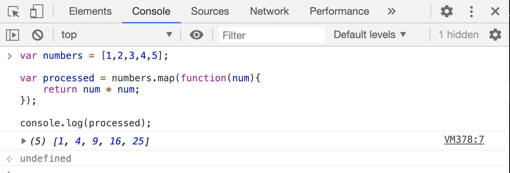
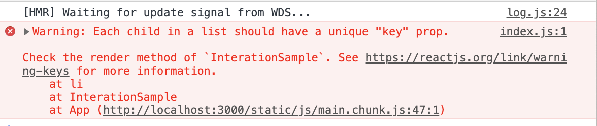
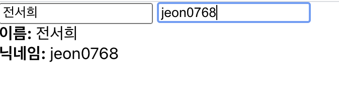
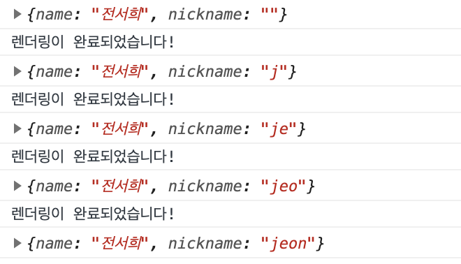

# 3주차 React 스터디 정리

| 장  | 제목                           |
| --- | ------------------------------ |
| 6장 | 컴포넌트 반복                  |
| 7장 | 컴포넌트와 라이프사이클 메서드 |
| 8장 | Hooks                          |

## 6장 컴포넌트 반복

```javascript:iterationSample.js
import React from 'react';

const InterationSample = () => {
    return(
        <ul>
            <li>눈사람</li>
            <li>얼음</li>
            <li>눈</li>
            <li>바람</li>
        </ul>
    );
};

export default InterationSample;
```

코드가 계속 반복 됨 → 코드양 늘어나며 파일용량 증가!<br>
📌효율적으로 보여주고 관리하자

### 6.1 자바스크립트 배열의 map() 함수

- 자바스크립트 배열 객체의 내장함수인 map() 함수 사용하여 반복되는 컴포넌트를 렌더링
- map 함수는 파라미터로 전달된 함수를 사용해 배열 내 각 요소를 원하는 규칙에 따라 변환한 후 그 결과로 새로운 배열을 생성

#### 6.1.1 문법

```
arr.map(callback, [thisArg])
```

함수의 파라미터

- callback: 새로운 배열의 요소를 생성하는 함수
  - current Value: 현재 처리하고 있는 요소
  - index: 현재 처리하고 있는 요소의 index 값
  - array: 현재 처리하고 있는 원본 배열

* thisArg(선택 항목): callback 함수 내부에서 사용할 this 레퍼런스

#### 6.1.2 예제

📌[1,2,3,4,5]의 각 요소를 제곱해서 새로운 배열 생성해보자 !!

```javascript
var numbers = [1, 2, 3, 4, 5];

var processed = numbers.map(function (num) {
  return num * num;
});

console.log(processed);
```



📌ES6문법으로 작성해보자 !!

```javascript
const numbers = [1, 2, 3, 4, 5];

const result = numbers.map((num) => num * num);
console.log(result);
```

- var 대신에 const 사용
- function(...){...} 대신 화살표 함수를 사용

### 6.2 데이터 배열을 컴포넌트 배열로 변환하기

#### 6.2.1 컴포넌트 수정하기

```javascript:IterationSample.js
mport React from 'react';

const InterationSample = () => {
    const names = ['눈사람', '얼음', '눈', '바람'];
    const nameList = names.map(name => <li>{name}</li>);
    return <ul>{nameList}</ul>;
};

export default InterationSample;
```

1. 문자열로 구성된 배열 선언
2. 배열 값을 이용하여 <li></li>JSX코드로 된 배열 새로 생성한후 nameList에 담기

#### 6.2.2 App 컴포넌트에서 예제 컴포넌트 렌더링

```javascript:IterationSample.js
import React, {Component} from 'react';
import IterationSample from './IterationSample';

class App extends Component {
  render() {
    return ( <
      IterationSample / >
    );
  }
}

export default App;
```



🚨"key" prop이 없다는 경고 메세지... key란?

### 6.3 key

리액트에서 key란?

- 컴포넌트 배열을 렌더링 했을 때 어떤 원소에 변동이 있었는지 알아내려고 사용
- key가 없다면 Virtual DOM을 비교하는 과정에서 리스트를 순차적으로 비교하면서 변화 감지
- 하지만 key가 이싸면 이 값을 사용하여 어떤 변화가 일어났는지 더욱 빠르게 알아냄

#### 6.3.1 key 설정

map 함수의 인자로 전달되는 함수 내부에서 컴포넌트 props를 설정하듯이 설정하면 됨
key 값은 유일해야 함(데이터가 가진 고윳값을 key 값으로 설정)

```javascript
const articleList = articles.map((article) => (
  <Article title={article.title} writer={article.writer} key={article.id} />
));
```

🚨앞서 만들었던 예제 컴포넌트에는 고유 번호 X

❗map 함수에 전달 되는 콜백 함수의 인수인 index 사용할 것

```javascript:IterationSample.js
import React from 'react';

const InterationSample = () => {
    const names = ['눈사람', '얼음', '눈', '바람'];
    const nameList = names.map((name,index) => <li key={index}>{name}</li>);
    return <ul>{nameList}</ul>;
};

export default InterationSample;
```

🚨주의🚨 고유한 값이 없을 때만 index값을 Key 로 사용해야 함
→ index를 key로 사용하면 배열이 변경 될 때 효율적으로 리렌더링 하지 못함

### 6.4 응용

📌동적인 배열을 렌더링 하는 것 구현해보고
index 값을 key로 사용하지 않고 고유값 만들어보자 !!

1. 초기 상태 설정하기
2. 데이터 추가 기능 구현하기
3. 데이터 제거 기능 구현하기

#### 6.4.1 초기 상태 설정하기

useState를 사용하여 상태를 설정

세 가지 상태를 사용

1. 데이터 배열
2. 텍스트를 입력할 수 있는 input의 상태
3. 데이터 배열에서 새로운 항목을 추가할 때 사용할 고유 id를 위한 상태

객체로 이루어진 배열을 만들기 !!

```javascript:IterationSample.js
import React,{useState} from 'react';

const InterationSample = () => {
    const [names, setNames] = useState([
        {id: 1, text: '눈사람'},
        {id: 2, text: '얼음'},
        {id: 3, text: '눈'},
        {id: 4, text: '바람'}
    ]);
    const [inputText, setInputText] = useState('');
    const [nextId, setNextId] = useState(5);

    const nameList = names.map(name => <li key ={name.id}>{name.text}</li>);
    return <ul>{nameList}</ul>
};

export default InterationSample;
```

key 값을 index 대신 name.id로 지정

#### 6.4.2 데이터 추가 기능 구현

ul태그의 상단에 input과 button을 렌더링하고 input의 상태를 관리

```javascript:IterationSample.js
import React,{useState} from 'react';

const InterationSample = () => {
    const [names, setNames] = useState([
        {id: 1, text: '눈사람'},
        {id: 2, text: '얼음'},
        {id: 3, text: '눈'},
        {id: 4, text: '바람'}
    ]);
    const [inputText, setInputText] = useState('');
    const [nextId, setNextId] = useState(5);

    const onChange = e => setInputText(e.target.value);
    const onClick = () => {
        const nextNames = names.concat({
            id: nextId,
            text: inputText
        });
        setNextId(nextId + 1);
        setNames(nextNames);
        setInputText('');
    };

    const namesList = names.map(name => <li key ={name.id}>{name.text}</li>);
    return (
        <>
        <input value={inputText} onChange={onChange} />
        <button onClick={onClick}>추가</button>
        <ul>{namesList}</ul>
        </>
    );
};

export default InterationSample;
```

- 버튼을 클릭했을 때 호출할 onClick 함수를 선언하여 버튼의 onClick 이벤트로 설정
- onClick 함수에서는 배열의 내장 함수 concat을 사용하여 새로운 항목을 추가한 배열을 만들기
- 새로운 함수를 추가할 때 객체의 id 값은 nextId, 클릭될 때 마다 1씩 증가
- setNames를 통해 상태를 업데이트 -추가로 버튼이 클릭 될 때 기존 input 비우기

#### 6.3.4 데이터 제거 기능 구현하기

함수 filter 사용 : 불변성을 유지하면서 배열의 특정 항목을 지울 때 사용

❗filter 함수 사용하여 특정 조건을 만족하는 원소들만 분류하기

```javascript
const numbers = [1, 2, 3, 4, 5, 6];
const biggerThanThree = numbers.filter((number) => number > 3);
//결과 : [4,5,6]
```

-> filter 함수 인자에 조건을 반환 하는 함수 넣어 주면 쉽게 분류 가능

❗filter 함수 사용하여 특정 원소만 제외하기

```javascript
const numbers = [1, 2, 3, 4, 5, 6];
const withoutThree = numbers.filter((number) => number !== 3);
//결과 : [1,2,4,5,6]
```

❗filter 함수 사용하여 IterationSample 컴포넌트 항목 제거 기능 구현

```javascript:IterationSample.js
   const onRemove = id => {
       const nextNames = names.filter(name => name.id !== id);
       setNames(nextNames);
   };

   const namesList = names.map(name => (
   <li key ={name.id} onDoubleClick={()=>onRemove(name.id)}>
       {name.text}
       </li>
       ));
```

HTML 요소를 더블클릭할 때 onRemove 함수 실행할 수 있도록 이벤트 등록

### 6.5 정리

- 반복되는 데이터를 렌더링 하는 방법, 유동적인 배열 다루는 방법
- 컴포넌트 배열 렌더링 시 key 값 설정 주의(중복 시 오류)
- 상태 안에서 배열 변경시 직접 접근 수정 X, concat, filter 함수로 새로운 배열 생성

## 7장 컴포넌트의 라이프 사이클 메서드

모든 리액트 컴포넌트에는 라이프사이클(수명 주기)이 존재한다.

컴포넌트를 처음 렌더링 할 때, 업데이트 전 후에 작업이 필요
-> 컴포넌트 라이프사이클 메서드 사용(클래스형 컴포넌트에서만 사용 가능, 함수형 사용 X->Hooks 기능)

### 7.1 라이프사이클 메서드의 이해

라이프사이클 메서드는 `마운트`, `업데이트`, `언마운트` 카테고리로 분류

#### 마운트

DOM이 생성되고 웹 브라우저상에 나타나는 것

- `constructor`: 컴포넌트를 새로 만들 때마다 호출되는 클래스 생성자 메서드
- `getDerivedStateFromProps`: props에 있는 값을 state에 넣을 때 사용하는 메서드
- `render`: 우리가 준비한 UI를 렌더링하는 메서드
- `componentDidMount`: 컴포넌트가 웹 브라우저상에 나타난 후 호출하는 메서드

#### 업데이트

업데이트 하는 경우

1. props가 바뀔 때
2. state가 바뀔 때
3. 부모 컴포넌트가 리렌더링 될 때
4. this.forceUpdate로 강제로 렌더링을 트리거할 때

- `getDrivedStateFromProps`: props변화에 따라 state 값도 변화 줄 때 사용
- `shouldComponentUpdate`: 컴포넌트가 리렌더링을 해야 할지 말아야 할지를 결정하는 메서드
- `render`: 컴포넌트를 리렌더링
- `getSnapshotBeforeUpdate`: 컴포넌트 변화를 DOM에 반영하기 바로 직전에 호출하는 메서드
- `componentDidUpdate`: 컴포넌트의 업데이트 작업이 끝난 후 호출하는 메서드

#### 언마운트

마운트의 반대 과정, 컴포넌트를 DOM에서 제거하는 것

- `componentWillUnmount`: 컴포넌트가 웹 브라우저상에서 사라지기 전에 호출하는 메서드

### 7.2 라이프사이클 메서드 살펴보기

| 이름                            | 설명                                                                                                                                                                       |
| ------------------------------- | -------------------------------------------------------------------------------------------------------------------------------------------------------------------------- |
| render()함수                    | - 컴포넌트의 모양을 정의(유일한 필수 메서드) <br> - this.props와 this.state에 접근, 리액트 요소 반환                                                                       |
| constructor 메서드              | -생성자 메서드, 초기 state 정할 수 있음                                                                                                                                    |
| getDerivedStateFromProps 메서드 | -props로 받아온 값을 sate에 동기화 시킴<br>- 컴포넌트가 마운트, 업데이트 될 때 호출                                                                                        |
| componentDidMount 메서드        | - 컴포넌트를 만들고, 첫 렌더링을 다 마친후 실행<br>- 다른 자바스크립트 라이브러리, 프레임워크 함수 호출 또는 이벤트 등록, setTimeout, setInterval, 네트워크 요청 작업 처리 |
| shouldComponentUpdate 메서드    | -props, state 변경 시 리렌더링 시작할지 여부 지정<br> -반드시 true,false 값 반환                                                                                           |
| getSnapshotBeforeUpdate 메서드  | render에거 만들어진 결과물이 브라우저에 반영되기 직전에 호출                                                                                                               |
| componentDidUpdate 메서드       | 리렌더링을 완료한 후 실행, DOM 관련 처리 가능                                                                                                                              |
| componentWillUnmount 메서드     | -컴포넌트를 DOM에서 제거할 때 실행                                                                                                                                         |
| componentDidCatch 메서드        | 컴포넌트 렌더링 도중 에러 발생시 오류 UI를 보여줌                                                                                                                          |

### 7.3 라이프사이클 메서드 사용하기

```javascript:LifeCycleSample.js
import React, {Component} from 'react';

class LifeCycleSample extends Component{
    state = {
        number: 0,
        color: null,
    }

    myRef = null;

    constructor(props){
        super(props);
        console.log('constructor'); //컴포넌트를 만들 때 처음으로 실행
    }

    static getDerivedStateFromProps(nextProps,prevState){
        console.log('getDerivedStateFromProps');
        if(nextProps.color !== prevState.color){
            return{ color: nextProps.color};
        }
        return null; //props로 받아 온 값을 state에 동기화시키는 용도로 사용
        //컴포넌트가 마운트 될때, 업데이트 될 때 호출
    }

    componentDidMount(){
        console.log('componentDidMount');
    }//컴포넌트를 만들고, 첫 렌더링을 다 마친후 실행

    shouldComponentUpdate(nextProps,nextState){
        console.log('shouldComponentUpdate',nextProps,nextState);
        //숫자의 마지막 자리가 4면 리렌더링 하지 않음.
        return nextState.number % 10 !== 4;
    }//props, state 변경시에 리렌더링을 시작할지 여부를 지정하는 메서드

    componentWillUnmount(){
        console.log('componentWillUnmount');
    }//컴포넌트를 DOM에서 제거할 때 사용

    handleClick = () => {
        this.setState({
            number: this.state.number +1
        });
    }//클릭했을 때 숫자 1 증가

    getSnapshotBeforeUpdate(prevProps, prevState){
        console.log('getSnapshotBeforeUpdate');
        if(prevProps.color !== this.props.color){
            return this.myRef.style.color;
        }
        return null;
    }//render에서 만들어진 결과물이 브라우저에 실제로 반영되기 직전에 호출

    compoenetDidUpdate(prevProps, prevState, snapshot){
        console.log('componentDidUpdate', prevProps, prevState);
        if(snapshot){
            console.log('업데이트되기 직전 색상: ', snapshot);
        }
        //주로 업데이트하기 직전의 값을 참고할 일이 있을 때 활용
    }
    render(){
        console.log('render');
        const style = {
            color:this.props.color
        };

        return(
            <div>
                <h1 style={style} ref={ref => this.myRef=ref}>
                    {this.state.number}
                </h1>
                <p>color: {this.state.color}</p>
                <button onClick={this.handleClick}>
                    더하기
                </button>
            </div>
        )
    }
}
export default LifeCycleSample;
```

### 7.4 정리

| 마운트                   | 업데이트                | 언마운트             |
| ------------------------ | ----------------------- | -------------------- |
| constructor              |                         | componentWillUnmount |
| getDerivedStateFromprops |                         |
|                          | shouldComponentUpdate   |                      |
| render                   |                         |
|                          | getSnapshotBeforeUpdate |                      |
| componentDidMount        | componentDidUpdate      |                      |

## 8장

🍕`Hooks`: 함수형 컴포넌트에서도 상태 관리를 할 수 있는 useState, 렌더링 직후 작업을 설정하는 useEffect 등의 기능을 제공

### 8.1 useState

🍕`useState`: 함수형 컴포넌트에서도 가변적인 상태를 지닐 수 있게 함

- 함수형 컴포넌트에서 상태 관리해야할 때 사용

📌useState 기능을 사용해서 숫자 카운터 구현해보자!!

```javascript:Counter.js
   import React, {useState} from 'react';

const Counter = () => {
    const [value, setValue] = useState(0); //상태의 기본값 넣어주기
    //첫번쨰 원소는 상태 값, 두번째 원소는 상태를 설정하는 함수
    return (
        <div>
            <p>
                현재 카운터 값은 <b>{value}</b>입니다.
            </p>
            <button onClick={()=>setValue(value + 1)}>+1</button>
            <button onClick={()=>setValue(value - 1)}>-1</button>
        </div>
    );
};

export default Counter;
```

📌useState를 여러번 사용해보자!!!

```javascript:Info.js
import React, {useState} from 'react';

const Info = () => {
    const [name, setName] = useState('');
    const [nickname, setNickname] = useState('');

    const onChangeName = e => {
        setName(e.target.value);
    };

    const onChangeNickname = e => {
        setNickname(e.target.value);
    };

    return(
        <div>
            <div>
                <input value ={name} onChange={onChangeName}/>
                <input value={nickname} onChange={onChangeNickname}/>
            </div>
            <div>
                <div>
                    <b>이름:</b>{name}
                </div>
                <div>
                    <b>닉네임:</b>{nickname}
                </div>
            </div>
        </div>
    );
};

export default Info;
```

결과


### 8.2 useEffect

🍕`useEffect`: 리액트 컴포넌트가 렌더링될 때마다 특정 작업을 수행하도록 설정할 수 있는 Hook

- 클래스형 컴포넌트의 componentDidMount와 coponentDidUpdate를 합친 형태

```javascript:Info.js
useEffect(()=>{
            console.log('렌더링이 완료되었습니다!');
            console.log({
                name,
                nickname
            });
        });
```



📌마운트 될 때만 실행하고 싶을 때

```javascript:Info.js
useEffect(()=>{
            console.log('마운트될 떄만 실행됩니다.');
        },[]);
```

컴포넌트가 처음 나타날 떄만 콘솔에 문구가 나타나고, 이후에는 X

📌특정 값이 업데이트될 때만 실행하고 싶을 때

```javascript:Info.js
useEffect(()=>{
            console.log(name);
        },[name]);
```

name값만 바뀔 때만 특정 작업을 수행한다, id값은 바뀌어도 작업 수행 X

### 8.3 useReducer

🍕`useReducer`: useState보다 더 다양한 컴포넌트 상황에 따라 다양한 상태를 다른 값으로 업데이트해 주고 싶을 때 사용하는 Hook
🍕`리듀서`:

- 현재 상태, 업데이트를 위해 필요한 정보를 담은 액션값을 전달받아 새로운 상태로 반환하는 함수
- 리듀서 함수에서 새로운 상태를 만들 때 반드시 불변성을 지켜주어야 함

```javascript:
function reducer(state, action){
    return { ... }; //불변성을 지키면서 업데이트한 새로운 상태를 반환

}

{
    type: 'INCREMENT',
    //다른 값들이 필요하다면 추가로 들어감
}

```

17장에서 다루는 리덕스에서 사용하는 액션 객체에는 type필드 필수,
useReducer에서 사용하는 액션 객체는 반드시 type 지닐 필요 X

📌useReducer을 사용하여 카운터를 구현해보자!!

```javascript:Counter.js
import React, {useReducer} from 'react';

function reducer(state, action){
    //action.type에 따라 다른 작업 수행
    switch(action.type){
        case 'INCREMENT':
            return {value: state.value + 1};
        case 'DECREMENT':
            return {value: state.value - 1};
        default:
            //아무것도 해당되지 않을 때 기존 상태 변환
            return state;
    }
}

const Counter = () => {
    const [state, dispatch] = useReducer(reducer, {value: 0});
    //useReducer의 첫번쨰 파라미터에는 리듀서 함수, 두번째 파라미터에는 해당 리듀서의 기본 값
    //state는 현재 가리키고 있는 상태, dispatch는 액션을 발생시키는 함수
    return (
        <div>
            <p>
                현재 카운터 값은 <b>{state.value}</b>
            </p>
            <button onClick={()=>dispatch({type:'INCREMENT'})}>+1</button>
            <button onClick={()=>dispatch({type:'DECREMENT'})}>-1</button>
        </div>
    );
};

export default Counter;
```

- `useReducer` 장점: 컴포넌트 업데이트 로직을 컴포넌트 바깥으로 빼낼 수 있다.

📌useReducer을 사용하여 Info 컴포넌트에서 인풋 상태를 관리해보자!!

```javascript:Info.js
   import React, {useReducer} from 'react';

function reducer(state, action){
    return {
        ...state,
        [action.name]: action.value
    };
}

const Info = () => {
    const [state, dispatch] = useReducer(reducer,{
        name: '',
        nickname: ''
    });
    const {name, nickname} = state;


    const onChange = e => {
        dispatch(e.target);
    };

    return(
        <div>
            <div>
                <input name="name" value={name} onChange={onChange} />
                <input name="nickname" value={nickname} onChange={onChange} />
            </div>
            <div>
                <div>
                    <b>이름:</b>{name}
                </div>
                <div>
                    <b>닉네임:</b>{nickname}
                </div>
            </div>
        </div>
    );
};

export default Info;
```

이벤트 객체가 지니고 있는 e.target값을 액션 값으로 사용
-> 인풋의 개수가 많아져도 코드를 짧고 깔끔하게 유지 가능

### 8.4 useMemo

🍕`useMemo`: 함수형 컴포넌트 내부에서 발생하는 연산 최적화

📌useMemo를 사용하여 리스트에 숫자를 추가하면 추가된 숫자들의 평균을 보여주는 함수형 컴포넌트를 작성해보자!!

```javascript:Average.js
import React, {useState, useMemo} from 'react';

const getAverage = numbers => {
    console.log('평균값 계산 중..');
    if (numbers.length === 0) return 0;
    const sum = numbers.reduce((a,b)=>a+b);
    return sum / numbers.length;
};

const Average = () => {
    const [list, setList] = useState([]);
    const [number, setNumber] = useState('');

    const onChange = e => {
        setNumber(e.target.value);
    };
    const onInsert = () => {
        const nextList = list.concat(parseInt(number));
        setList(nextList);
        setNumber('');
    };

    const avg = useMemo(()=> getAverage(list),[list]);

    return(
        <div>
            <input value={number} onChange ={onChange}/>
            <button onClick={onInsert}>등록</button>
            <ul>
                {list.map((value, index)=>(
                    <li key={index}>{value}</li>
                ))}
            </ul>
            <div>
                <b>평균값:</b> {avg}
            </div>
        </div>
    );
};

export default Average;
```

useMemo Hook을 사용하면 렌더링하는 과정에서 특정 값이 바뀌었을 떄만 연산을 실행하고, 원하는 값이바뀌지 않았다면 이전에 연산했던 결과를 다시 사용하는 방식

### 8.5 useCallback

🍕`useCallback`: useMemo와 비슷한 함수, 주로 렌더링 성능을 최적화 할 때 사용,
이벤트 핸들러 함수를 필요할 때만 생성 가능

📌useMemo를 사용하여 구현한 Average 컴포넌트에서 onChange, onInsert함수를 선언해주었는데, 컴포넌트가 리렌더링 될 때마다 함수들이 새로 생성 됨. 이 부분을 최적화 해보자!

```Javascript:Average.js
const onChange = useCallback(e=> {
        setNumber(e.target.value);
    },[]); //컴포넌트가 처음 렌더링될 때만 함수 생성
    const onInsert = useCallback(() => {
        const nextList = list.concat(parseInt(number));
        setList(nextList);
        setNumber('');
    },[number,list]); //number 혹은 list가 바뀌었을 때만 함수 생성
```

- `useCallback` 첫번째 파라미터에는 생성하고 싶은 `함수`를 넣고, 두번째 파라미터에는 `배열`을 넣으면 된다.(배열에는 어떤 값이 바뀌었을 때 함수를 새로 생성해야하는지 명시)
- `onChange`처럼 비어 있는 배열을 넣으면 렌더링 될 때 한 번만 함수가 생성,
  `onInsert`처럼 배열 안에 number와 list를 넣게 되면 인풋 내용이 바뀌거나 새로운 항목이 추가 될 때마다 함수 생성

```Javascript
useCallback(()=>{
    console.log('hello world');
},[])

useMemo(()=>{
    const fn = () =>{
        console.log('hello world');
    };
    return fn;
},[])
```

- `useCallback`은 `useMemo`로 함수를 반환하는 상황에서 더 편하게 사용할 수 있는 Hook
- 숫자, 문자열, 객체처럼 일반 값을 재사용하려면 useMemo를 사용하고, 함수를 재사용하려면 useCallback을 사용

### 8.6 useRef

🍕`useRef`: 함수형 컴포넌트에서 ref를 쉽게 사용할 수 있도록 함

📌useMemo를 사용하여 구현한 Average 컴포넌트에서 onChange, onInsert함수를 선언해주었는데, 컴포넌트가 리렌더링 될 때마다 함수들이 새로 생성 됨. 이 부분을 최적화 해보자!

```Javascript:Average.js
import React, {useState, useMemo, useCallback,useRef} from 'react';

const getAverage = numbers => {
    console.log('평균값 계산 중..');
    if (numbers.length === 0) return 0;
    const sum = numbers.reduce((a,b)=>a+b);
    return sum / numbers.length;
};

const Average = () => {
    const [list, setList] = useState([]);
    const [number, setNumber] = useState('');
    const inputE1 = useRef(null);

    const onChange = useCallback(e=> {
        setNumber(e.target.value);
    },[]); //컴포넌트가 처음 렌더링될 때만 함수 생성
    const onInsert = useCallback(() => {
        const nextList = list.concat(parseInt(number));
        setList(nextList);
        setNumber('');
        inputE1.current.focus();
    },[number,list]); //number 혹은 list가 바뀌었을 때만 함수 생성

    const avg = useMemo(()=> getAverage(list),[list]);

    return(
        <div>
            <input value={number} onChange ={onChange} ref={inputE1}/>
            <button onClick={onInsert}>등록</button>
            <ul>
                {list.map((value, index)=>(
                    <li key={index}>{value}</li>
                ))}
            </ul>
            <div>
                <b>평균값:</b> {avg}
            </div>
        </div>
    );
};

export default Average;
```

useRef를 사용하여 ref를 설정하면 useRef를 통해 만든 객체 안의 current값이 실제 엘리먼트를 가리킴

### 8.7 커스텀 Hooks 만들기

🍕`커스텀 Hooks`: 여러 컴포넌트에서 비슷한 기능을 공유할 경우, 나만의 Hook으로 작성하여 로직을 재사용할 수 있음

📌기존에 Info 컴포넌트에서 여러 개의 인풋을 관리하기 위해 useReducer로 작성했던 로직을 useInputs라는 Hook으로 따로 분리해 보자!

```javascript:useInputs
import {useReducer} from 'react';

function reducer(state, action){
    return {
        ...state,
        [action.name]: action.value
    };
}

export default function useInputs(initialForm){
    const [state, dispatch] = useReducer(reducer, initialForm);
    const onChange = e => {
        dispatch(e.target);
    };
    return [state, onChange];
}
```

### 8.8 다른 Hooks

[Hooklist](https://github.com/streamich/react-use).

### 8.9 정리

- Hooks 패턴을 사용하면 `클래스형 컴포넌트`를 작성하지 않아도 대부분 기능 구현 가능
- 유지 보수 하고 있는 프로젝트에서 `클래스형 컴포넌트` 사용하고 있다면, 굳이 `함수형 컴포넌트`와 `Hooks`를 사용하는 형태로 전환할 필요 X
- 하지만, 새로 작성하는 컴포넌트의 경우 `함수형 컴포넌트`와 `Hooks` 사용을 권장
- `함수형 컴포넌트` 사용을 첫번쨰 옵션으로 두고, 꼭 필요한 상황에서만 `클래스형 컴포넌트` 사용할 것

---
