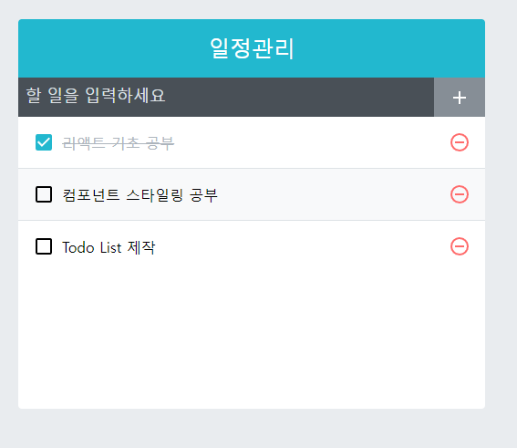

# 4주차 React 스터디 정리

| 장   | 제목                             |
| ---- | -------------------------------- |
| 9장  | 컴포넌트 스타일링                |
| 10장 | 일정 관리 웹 어플리케이션 만들기 |
| 11장 | 컴포넌트 성능 최적화             |

## 9장

### 9.1 가장 흔한 방식, 일반 CSS

리액트에서도 일반적으로 쓰는 CSS 방식을 쓸 수 있습니다

```css
// App.css
.App {
  text-align: center;
  font-size: 10px;
  ...
}
.container {
  color: red;
}
```

불러오는 방법은 컴포넌트를 불러오듯 import하면 됩니다

```javascript
import './App.css';

const App = () => {
  return(
    <div className="container">컨테이너</div>
  );
}
```

### 9.2 Sass 사용하기

css의 복잡한 작업을 쉽게 할 수 있도록 하고 가독성을 높여 유지보수를 더 쉽게 해주는 스타일시트입니다

Sass는 두 가지 확장자가 존재합니다

- `.scss`
- `.sass`

이 둘의 문법은 꽤 차이가 있는데 다음의 예시를 봅시다

#### .sass

```css
// sass 사용
$font-stack: Helvetica, sans-serif
#primary-color: #333

body
  font: 100% font-stack
  color: $primary-color
```

`.sass`의 특징으로는 `중괄호( { } )`와 `세미콜론(;)`을 사용하지 않습니다

#### .scss

```css
// scss 사용
$font-stack: Helvetica, sans-serif
#primary-color: #333

body {
  font: 100% $font-stack;
  color: $primary-color;
}
```

`.scss`의 특징은 일반적인 `css`와 많이 유사한 문법 체계를 가지고 있습니다

#### Sass를 작성할 때 여러 파일에서 자주 사용되는 Sass 변수 등은 파일을 따로 분리한 뒤 쉽게 불러와 사용할 수 있습니다

```css
// utils.scss
$red: #fa5252;
...

@mixin square($size) {
  #calcuated: 32px * $size;
  width: $calculated;
}
```
```css
// utils 불러와 사용하기
@import './styles/utils';
.SassComponent{
  .box {
    background: red;
    ...
  }
}
```

### 9.3 CSS Module

CSS Moudle: `[파일이름]_[클래스이름]_[해시값]` 형태로 클래스명을 만들어 스타일 클래스 이름이 중복되는 현상을 방지
📌 구버전 create-react-app의 웹팩에서는 css-loader를 따로 설정해야하지만 v2 버전에서 부터는 따로 설정할 필요가 없다

```css
/* CSSMoudle.modules.css (확장자를 .moudle.css로 하자) */

.wrapper{
  background: black;
  padding: 1rem;
  color: white;
  font-size: 2rem;
}

/* 글로벌 CSS 적용 */
:global .somthing {
  font-weight: 800;
  color: aqua;
}
```

CSS Module의 장점: 클래스 명을 정할 때 고유성에 대해 고민하지 않아됨

#### 만약, CSS Moudle 클래스를 두 개 이상 적용할 때
```css
import styles from './CSSMoudle.moudle.css';

const CSSMoudle = () => {
  return(
    // 고유한 클래스 이름 사용 위해 {styles.[클래스이름]} 형태로 작성
    <div className={`${styles.cssName01} ${styles.cssName02}`}> {/* 탬플릿 리터럴로 작성 */}
      hello world!
    </div>
  );
}
```

#### classnames 라이브러리

CSS 클래스를 조건부로 설정할 때 유용한 라이브라리, CSS Moudle과 같이 사용하면 여러 클래스를 적용할 때 매우 편리하다

```
yarn add classnames
```

#### .moudle.css를 Sass로도 사용할 수 있다
```css
/* CSSMoudle.module.scss */
.wrapper {
  backgroud: black;
  padding: 1rem;
  &.inverted {
    // .wrapper과 함께인 상태로 inverted가 사용될 때만 적용됨
    color: black;
    background: white;
    border: 1px solid black;
  }
}

:global {
  .something {
    font-weight: 800;
    color: aqua;
  }
}
```

📌 CSS Module이 아닌 일반 css, scss 파일에서도 :local을 통해 CSS Moudle을 사용할 수 있다

### 9.4 styled-components

자바스크립트 파일 안에 스타일을 선언하는 방식을 `CSS-in-JS`라고 부른다

대표적인 CSS-in-JS는 `styled-component`가 있다

```shell
yarn add styled-components
```

#### 자바스크립트 안에 바로 스타일을 작성할 수 있다
```javascript
import styled, { css } from 'styeld-components';

const Box = styled.div`
  /* props로 넣은 값을 직접 전달해 줄 수 있다 */
  background: ${props => props.color || 'blue'};
  padding: 1rem;
  display: flex;
`

const Button: =styled.button`
  background: white;
  color: black;
  display: flex;
  align-items: center;
  justify-content: center;
  
  &:hover{ /* Button 이 hover했을 때 */
    background: rgba(255, 255, 255, 0.9);
  }
  /* props로 받아온 inverted 값이 ture일 때 스타일 부여 */
  ${props =>
    props.inverted &&
    css`
      background: none;
      border: 2px solid whiete;
      color: white;
      &:hover {
        background: white;
        color: black;
      }
  `};
 & + button {
  margin-left: 1rem;
 }
`;

const StyledComponent = () => (
  <Box color="black">
    <Button>hello</Button>
    <Button inverted={true}>inverted</Button>
  </Box>
);

export default StyledComponent;
```

📌 styled-component 작성시 백틱(tap키 위에 있는 것)을 이용했는데 이를 `Tagged 템플릿 리터럴`이라고 한다

일반적인 템플릿 리터럴과 다른 점: 템플릿 안에 JS 객체나 함수 전달시 온전히 추출할 수 있다

보통, 템플릿에 객체나 함수를 넣으면 `[object Object]`, 함수는 함수 내용이 그대로 문자열화 돈다

#### div, input과 같은 태그 말고 유동적이거나 특정 컴포넌트 자체에 스타일링을 원할 때 아래의 형태로 작성 가능하다

```javascript
// input 대그 타입을 styled 함수의 인자로 전달
const MyInput = styled('input')`
  background: gray;
`

// Link라는 컴포넌트를 넣어줌
const StyledLink = styled(Link)`
  color: blue;
`
```

#### styled-component에서 조건부 스타일링

```javascript
import styled from 'styled-components';

const Button = styled.button`
  background: white;
  color: black;
  display: center;
  justify-content: center;
  
  // 조건부 스타일링
  ${props =>
    props.inverted && css`
      background: none;
      border: 2px solid white;
      color: white;
    `
  };
`
```

📌 styled-component도 css와 마찬가지로 `@midea` 속성을 사용해 `반응형 웹`만들 을 수 있다

<br />

## 10장

### 10.1 프로젝트 준비하기

📢 10장은 실습 파트라 간략하게 추가적인 정보만 설명합니다

프로젝트를 생성하고 필요한 라이브러리를 설치합니다
```
yarn create react-app todo-app

cd todo-app
yarn add node-sass@4.14.1 classnames react-icons
```

[2장](../../발표/1주차.md)에서 잠깐 나왔던 prettier를 설정해줍니다

최상위 디렉터리에 `.prettierrc`파일을 설정하고 아래 내용을 입력합니다

```
// .prettierrc
{
  "singleQuote": true, // 작은따옴표로 설정
  "semi": true, // 세미콜론 필수
  "useTabs": falsee,
  "tabWidth": 2, // 탭은 스페이스바 2칸
  "trailingComma": "all",
  "printWidth": 80,
}
```

다음으로 index.css를 수정해줍니다
```
body{
  margin: 0;
  padding: 0;
  background: #e9ecef;
}
```

### 10.2 UI 구성하기

아래의 컴포넌트를 작성합니다 각 컴포넌트의 코드는 [여기](./src)에 있습니다

- `TodoTemplate`: 화면을 가운데 정렬, 앱 타이틀 보여줌, children으로 내부 JSX를 props로 받아와 렌더링
- `TodoInert`: 새로운 일정을 입력, 추가, state로 input 상태 관리
- `TodoListItem`: 각각 항목에 대한 정보를 보여주는 컴포넌트
- `TodoList`: 할일 목록 배열을 props로 받고 map을 통해 `TodoListItem`을 차례로 매핑

책에 나온 코드를 차례대로 입력하며 UI를 구성하고, 스타일링을 해줍니다

📌 react-icons를 통해 여러 아이콘을 쉽게 쓸 수 있음

#### UI 결과



<br />

### 10.3 기능 구현하기

#### `TodoInsert.js`에서 항목 입력 기능을 구현합니다

8장 Hooks에서 배운 내용을 토대로 input 기능을 구현합니다

📌 컴포넌트가 정상적으로 동작하는 것을 확인하기 위해 `리액트 개발자 도구`를 설치합시다 크롬 브라우저에서 `React Developer Tools`를 설치해주세요

#### todos배열에 새로운 일정 추가를 위한 기능을 추가합니다

이때, id 상태는 `useState`가 아닌 `useRef`로 받습니다 id는 `컴포넌트에서 랜더링되는 정보가 아니기 때문입니다`

```javascript
const nextId = useRef(4);
```

또한 값을 넣어주는 `onInsert`함수는 `useCallback`으로 감싸줬습니다

📌 `props`로 전달해야 할 함수를 만들 때 컴포넌트 성능을 아끼기 위해 `useCallback`으로 함수를 감싸는 것을 습관화 하는 것이 좋습니다

```javascript
const onInsert = useCallback(
    text => {
      const todo = {
        id: nextId.current,
        text,
        checked: false,
      };
      // concat으로 원본배열은 보존하고 새로운 복사 배열 생성
      setTodos(todos.concat(todo));
      nextId.current += 1; // nextId 증가
    },
    [todos],
  );
```

📌 `onSubmit` 이벤트에서 `submit`은 `페이지 새로고침`을 발생시키는 함수입니다 리액트에서는 페이지 새로고침을 발생시키는 것은 최대한 `지양`해야하므로 페이지 새로고침을 방지하기 위해 `e.preventDefault()` 함수를 호출해 새로고침을 방지합니다

```javascript
const onSubmit = useCallback(e => {
        ...
        e.preventDefault();
    },[onInsert, value]);
```

📌 항목 지우는 기능은 `filter`를 이용합니다
```javascript
const onRemove = useCallback(
    id => {
      // filter를 통해 선택된 값 이외의 배열을 모두 리턴
      setTodos(todos.filter(todo => todo.id !== id));
    },
    [todos],
  );
```

<br />

### 10.4 정리

완성 모습


## 11장

### 11.1 많은 데이터 렌더링하기

아래는 todo 항목을 2500개로 만들어주는 코드입니다 이 코드를 App.js에서 todos의 기본 상태로 설정해주세요
```javascript
function createBulkTodos() {
  const array = [];
  for (let i = 1; i <= 2500; i++) {
    array.push({
      id: i+3,
      text: `할일 ${i+3}`,
      checked: false,
    });
  }
  return array;
}
```

2500개의 todos를 삭제하거나 수정하는 경우 확실히 동작이 느려지는 것을 알 수 있습니다

<br/>

### 11.2 크롬 개발자 도구를 통한 성능 모니터링

크롬 개발자도구 (윈도우 기준 F12)에서 perfomance 탭에서 성능을 측정할 수 있습니다

현재 리렌더링 속도는 대략 0.5 ~ 1초 정도 소요됩니다

### 11.3 느려지는 원인 분석

지난 챕터에서도 나왔듯, 컴포넌트는 다음과 같은 상황에서 리렌더링이 발생합니다

- 전달받은 props 변경될 때
- 자신의 state가 바뀔 때
- 부모 컴포넌트가 리렌더링될 때
- forceUpdate 함수 발생했을 때

현재 todo에 대해 발생되는 문제는 `세 번째 항목`인 부모 컴포넌트의 리렌더링에 의한 컴포넌트 리렌더링입니다

todo에 변과가 생기면 App 컴포넌트의 state가 변경되면서 App 리렌더링 → 자식 컴포넌트더 리렌더링 하는 것이죠

### 11.4 React.memo를 사용하여 컴포넌트 성능 최적화

`shouldComponentUpdate` 라는 라이프 사이클을 사용해 컴포넌트의 리렌더링을 방지해봅시다

함수형 컴포넌트에서는 `React.memo`를 사용해 이를 구현할 수 있습니다

`React.memo`를 통해 컴포넌트의 props가 바꾸지 않았다면 리렌더링하지 않도록 설정해봅시다

```javascript
// TodoListItem.js
import ...
const TodoListItem = ({todo, onRemove, onToggle}) => {
  ...
}

// React.memo로 컴포넌트 성능 최적화
export default React.memo(TodoListItem);
```

이를 통해 이 컴포넌트는 props로 받아온 `todo, onRemove, onToggle`가 변경되지 않는한 리렌더링이 발생하지 않습니다

<br/>

### 11.5 onToggle, onRemove 함수가 바뀌지 않게 하기

현재 프로젝트에서 todos 배열이 업데이트 된다면 App 컴포넌트의 `onRemove`와 `onToggle` 함수 또한 업데이트 됩니다

이 두 함수는 업데이트 과정에서 최신 상태의 todos 배열을 참조하기 때문입니다 (map, filter)

함수가 계속 만들어지는 상황을 방지하기 위해선 다음 두 가지 방법이 있습니다

- useState의 함수형 업데이트 기능
- useReducer를 사용

#### useStaste의 함수형 업데이트

기존 setTodos 함수를 사용할 때 항상 `새로운 상태`를 만들어 파라미터로 넣어줬습니다

이번에는 그대신 상태 업데이트를 어떻게 할지 정의하는 함수를 넣을 수 있습니다

아래는 예시입니다

```javascript
  const [number, setNumber] = useState(0);
  const onIncrease = useCallback(
    // prevNumber는 현재 number 상태
    () => setNumber(prevNumber => prevNumber + 1), []);
  )
```

이를 App 컴포넌트에 적용할시

함수 업데이트가 발생하는 곳의 세터 함수 안에 `참조하는 state => (기존내용)`을 하면 됩니다

```javascript
const onRemove = useCallback(
  id => {
    // todos => 를 추가함
    setTodos(todos => todos.filter(todo => todo.id !== id));
  },
  [],
);
```

위와 같은 방법으로 `onToggle`와 `onInsert`에 적용을 하면 됩니다

📌 useState의 함수형 업데이트를 사용하면 useCallback에서 두 번째 요소에 빈 배열을 넣어도 됩니다

#### useReducer를 사용해 최적화를 할수도 있습니다

### 11.6 불변성의 중요성

리액트의 특징 중 하나는 `불변성`이 있습니다 따라서 컴포넌트에서 상태를 업데이트 할 때 불변성을 지키는 것은 매우 중요합니다

📌 전개 연산자(...문법)을 사용하면 객체나 배열 내부의 값을 복사할 때 얕은 복사를 하게됩니다 즉, 내부 값을 완전히 복사하는 것이 아닌 바깥쪽에 있는 값만 복사되므로 객체, 배열의 경우 그 내부의 값도 복사해야합니다

```javascript
const todos = [{id: 1, checked: true}, {id: 2, checked: true}];
const nextTodos = [...todos];

nextTodos[0].checked = false;
console.log(todos[0] === nextTodos[0]); // 얕은 복사로 인해 내부 값은 복사 안됨, true

nextTodos[0] = {
  ...nextTodos[0],
  checked: false
};
console.log(todos[0] === nextTodos[0]); // 내부 값을 복사해줬으니 false
```

배열이나 객체 구조가 복잡해진다면 이런 방법으로 불변성을 유지하긴 힘들어지는데 이때, immer를 통해 편하게 작업할 수 있습니다

<br />

### 11.7 TodoList 컴포넌트 최적화하기

📌 리스트와 관련된 컴포넌트를 작성할 때 `리스트`, `리스트아이템` 이 두 가지 컴포넌트를 최적화 해야하는 것을 기억하자

<br />

### 11.8 react-virtualized를 사용한 렌더링 최적화

현재 2500개의 todo를 가지고 있지만 정작 화면에 표시되는 것은 9개 정도입니다 나머지는 스크롤 해야 볼 수 있는 항목입니다

그런데도 불구하고 현재 2500개의 컴포넌트를 전부 렌더링하고 있습니다. 이런 단점을 통해 화면에 보이는 것만 렌더링해 최적화 하는 방법이 있습니다

`react-virtualized`를 사용해 화면에 보이지 않는 컴포넌트를 `렌더링하지 않고 크기만 차지하게`할 수 있습니다

yarn을 통해 라이브러리를 설치해주세요

```shell
yarn add react-virtualized
```

```javascript
import React, { useCallback } from 'react';
import TodoListItem from './TodoListitem';
import './TodoList.scss';
import { List } from 'react-virtualized'; // react-virtualized 호출

const TodoList = ({ todos, onRemove, onToggle }) => {
    const rowRenderer = useCallback(
            ({index, key, style}) => {
                // todo는 todos배열 index 번째 요소
                const todo = todos[index]
                return(
                    <TodoListItem
                        todo = {todo}
                        key = {key}
                        onRemove = {onRemove}
                        onToggle = {onToggle}
                        style = {style}
                    />
                );
            }
        ,[onRemove, onToggle, todos]);

    return (
        <List
            className = "TodoList"
            width = {512}
            height = {513}
            rowCount = {todos.length} // 항목 개수
            rowHeight = {57} // 각 항목의 높이
            rowRenderer = {rowRenderer} // 항목 렌더링시 쓸 함수
            list = {todos} // 참고할 리스트
            style = {{ outline: 'none'}}
        />
    );
};

export default React.memo(TodoList);
```

List 컴포넌트를 위해 `rowRenderer` 함수를 만들었는데 이 함수는 TodoItem을 렌더링할 때 사용됩니다

이를 적용하고 나면 스타일이 깨지던가 하는 문제가 있는데 이는 책 `11.8.3`을 통해 수정하면 됩니다
