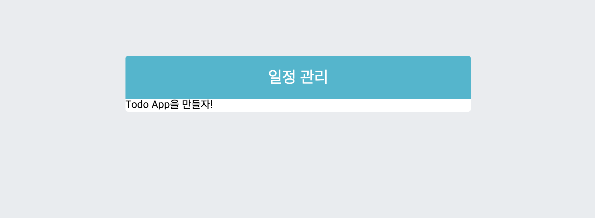
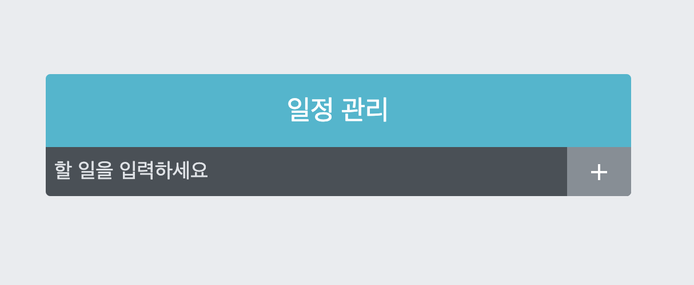
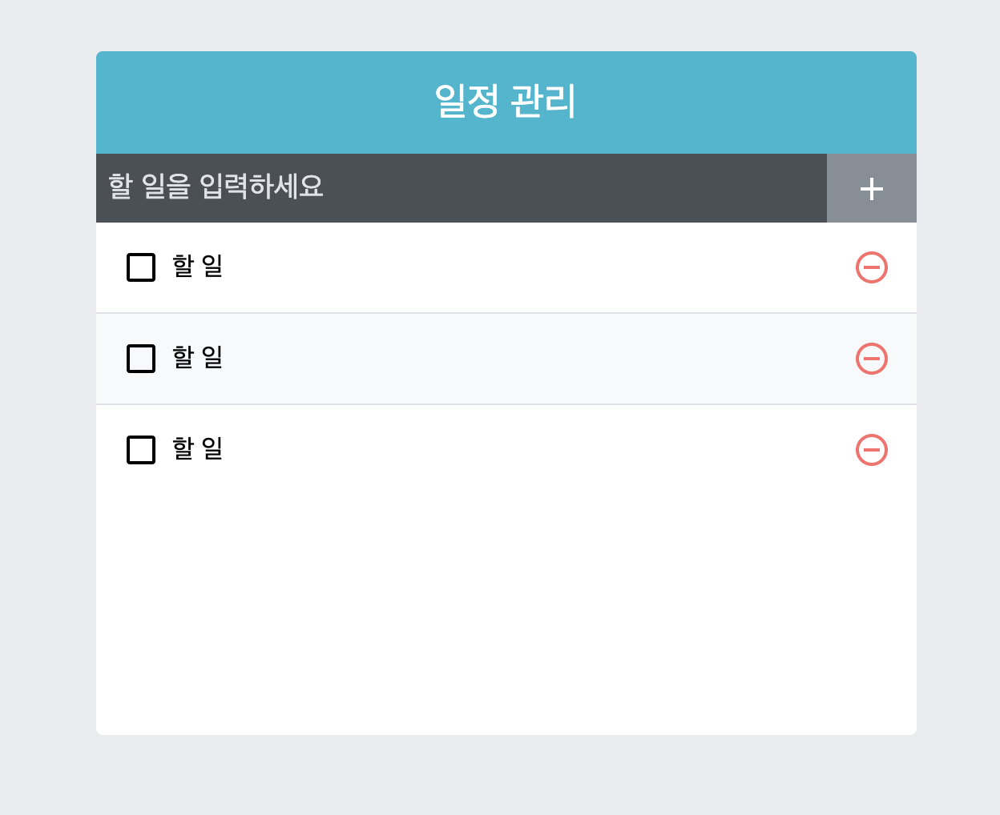
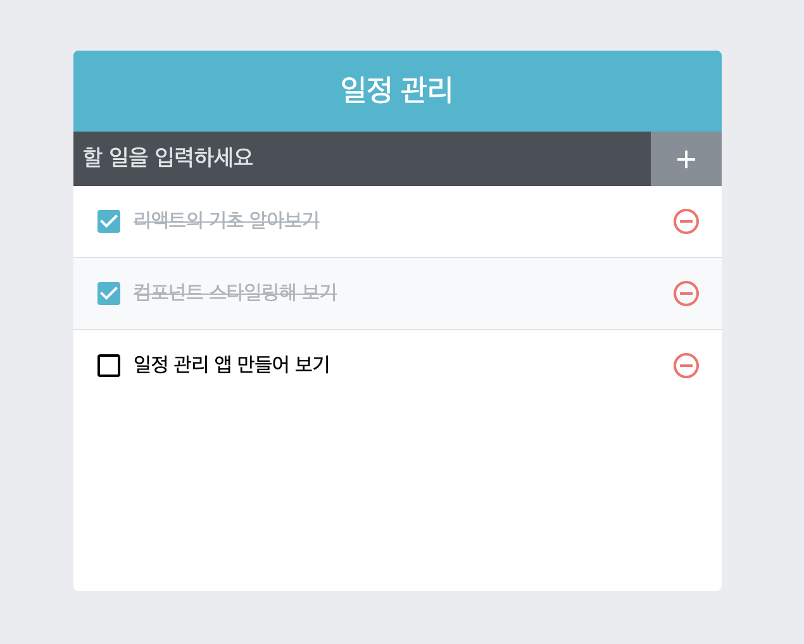
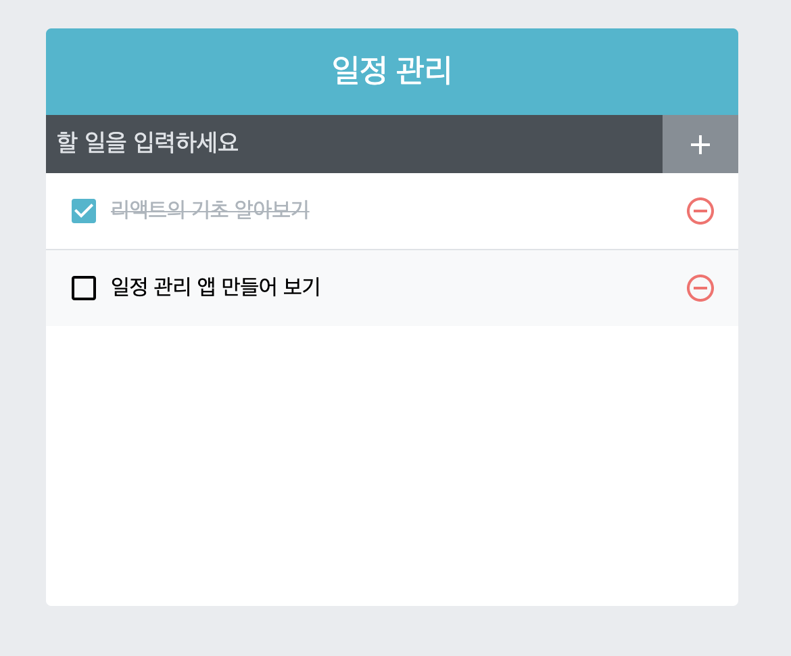

# 4주차 React 스터디 정리

| 장   | 제목                             |
| ---- | -------------------------------- |
| 9장  | 컴포넌트 스타일링                |
| 10장 | 일정 관리 웹 어플리케이션 만들기 |
| 11장 | 컴포넌트 성능 최적화             |

## 9장

스타일링 방식

- `일반 CSS`: 컴포넌트를 스타일링 하는 가장 기본적인 방식
- `Sass`: 자주 사용되는 CSS 전처리기 중 하나로 확장된 CSS 문법을 사용하여 CSS 코드를 더욱 쉽게 작성할 수 있도록 해 줌
- `CSS Module`: 스타일을 작성할 때 CSS 클래스가 다른 CSS 클래스의 이름과 절대 충돌하지 않도록 파일마다 고유한 이름을 자동으로 생성해 주는 옵션 -`styled-components`: 스타일을 자바스크립트 파일에 내장시키는 방식으로 스타일을 작성함과 동시에 해당 스타일이 적용된 컴포넌트를 만들 수 있게 해 줍니다.

### 9.1 가장 흔한 방식, 일반 CSS

🚨CSS클래스를 중복되지 않게 만드는 것이 중요!

- 클래스 이름은 `<컴포넌트 이름-클래스>`형태로 짓기 ex) App-header
- `BEM Naming`: 이름을 지을 때 어디서 어떤 용도로 사용되는지 명확하게 작성하는 방식 ex) .card_title-primary

- `CSS Selector`: CSS 클래스가 특정 클래스 내부에 있는 경우 스타일 적용 ex) .App .logo

```javascript:App.js
import React, {Component} from 'react';
import logo from './logo.svg';
import './App.css';

class App extends Component {
  render(){
  return (
    <div className="App">
      <header>
        
        <p>
          Edit <code>src/App.js</code> and save to reload.
        </p>
        <a
          href="https://reactjs.org"
          target="_blank"
          rel="noopener noreferrer"
        >
          Learn React
        </a>
      </header>
    </div>
  );
  }
}

export default App;
```

```javascript:App.css
.App {
  text-align: center;
}

.App-logo {

  animation: App-logo-spin infinite 20s linear;
  height: 40vmin;
}

@media (prefers-reduced-motion: no-preference) {
  .App-logo {
    animation: App-logo-spin infinite 20s linear;
  }
}

.App header {
  background-color: #282c34;
  min-height: 100vh;
  display: flex;
  flex-direction: column;
  align-items: center;
  justify-content: center;
  font-size: calc(10px + 2vmin);
  color: white;
}

.App a {
  color: #61dafb;
}

@keyframes App-logo-spin {
  from {
    transform: rotate(0deg);
  }

  to {
    transform: rotate(360deg);
  }
}
```

- 컴포넌트의 최상위 html 요소에는 컴포넌트의 이름으로 클래스 이름을 짓고, 그 내부에는 소문자를 입력하거나 header 같은 태그를 사용하여 클래스 이름이 불필요한 경우에는 아예 생략 할 수 있음

### 9.2 Sass 사용하기

`Sass(Syntatically Awesome Style Sheets)`: CSS 전처리기로 복잡한 작업을 쉽게 할 수 있도록 해주고, 스타일 코드의 재활용성을 높여 줄 뿐만 아니라 코드의 가독성을 높여서 유지 보수를 더욱 쉽게 해줌

-두가지의 확장자 존재(.scss와 .sass)

Sass적용해보기

```scss:SassComponent.scss
//변수 사용하기
$red: #fa5252;
$orange: #fd7e14;
$yellow: #fcc419;
$green: #40c057;
$blue: #339af0;
$indigo: #5c7cfa;
$violet: #7950f2;

//믹스인 만들기(재사용되는 스타일 블록을 함수처럼 사용할 수 있음)
@mixin square($size) {
    $calculated: 32px * $size;
    width: $calculated;
    height: $calculated;
}

.SassComponent {
    display: flex;

    .box {
        //일반 CSS에서는 .SassComponent .box와 마찬가지
        background: red;
        cursor: pointer;
        transition: all 0.3s ease-in;

        &.red {
            // .red클래스가 .box와 함께 사용되었을 때
            background: $red;
            @include square(1);
        }

        &.orange {
            background: $orange;
            @include square(2);
        }

        &.yellow {
            background: $yellow;
            @include square(3);
        }

        &.green {
            background: $green;
            @include square(4);
        }

        &.blue {
            background: $blue;
            @include square(5);
        }

        &.indigo {
            background: $indigo;
            @include square(6);
        }

        &.violet {
            background: $violet;
            @include square(7);
        }

        &:hover {
            //.box에 마우스를 올렸을 때
            background: black;
        }
    }
}
```

```javascript:SassComponent.js
import React from 'react';
import './SassComponent.scss';

const SassComponent = () => {
    return (
        <div className="SassComponent">
            <div className="box red" />
            <div className="box orange" />
            <div className="box yellow" />
            <div className="box green" />
            <div className="box blue" />
            <div className="box indigo" />
            <div className="box violet" />
        </div>
    );
};

export default SassComponent;


```

결과창


Utils 함수 분리하기

```scss:src/styles/utils.scss
/변수 사용하기
$red: #fa5252;
$orange: #fd7e14;
$yellow: #fcc419;
$green: #40c057;
$blue: #339af0;
$indigo: #5c7cfa;
$violet: #7950f2;

//믹스인 만들기(재사용되는 스타일 블록을 함수처럼 사용할 수 있음)
@mixin square($size) {
    $calculated: 32px * $size;
    width: $calculated;
    height: $calculated;
}

```

```scss:SassComponent.scss
@import './styles/utils';

.SassComponent {
    display: flex;

    .box {...}
```

다른 scss파일을 불러올 때는 @import 구문을 사용
-> 이전과 같은 결과!

sass-loader 설정 커스터마이징하기

- 프로젝트에 디렉터리를 많이 만들어져서 구조가 깊어졌다면 해당 파일에서는 다음과 같이
  상위 폴더로 한참 거슬러 올라가야 한다는 단점이 있음
- 웹팩에서 Sass를 처리하는 sass-loader의 설정을 커스터마이징하여 해결할 수 있음
- create-react-app으로 만든 프로젝트는 프로젝트 구조의 복잡도를 낮추기 위해 세부 설정이 숨겨져 있음
- 이를 커스터마이징하려면 프로젝트 디렉터리에서 yarn eject 명령어를 통해 세부 설정을 밖으로 꺼내주어야 함

### 9.3 CSS Module

- CSS Module은 CSS를 불러와서 사용할 때 클래스 이름을 고유한 값,
  [파일이름]_[클래스이름]_[해시값] 형태로 자동으로 만들어서 클래스 이름이 중첩되는 현상을 방지

```scss:CSSModule.module.css
/* 자동으로 고유해질 것이므로 흔히 사용되는 단어 클래스 이름으로 마음대로 사용 가능 */
.wrapper{
    background: black;
    padding: 1rem;
    color: white;
    font-size:2rem;
}

/* 글로벌 CSS를 작성하고 싶다면 */
:global .something{
    font-weight: 800;
    color: aqua;
}
```

해당 클래스는 우리가 방금 만든 스타일을 직접 불러온 컴포넌트 내부에서만 작동
만약 특정 클래스가 웹 페이지 전역적으로 사용되는 경우라면 :global을 앞에 입력하여
글로벌 CSS임을 명시할 수 있음

```javascript:CSSModule.js
import React from 'react';
import styles from './CSSModule.module.css';
const CSSModule = () => {
    return(
        <div className={styles.wrapper}>
            안녕하세요, 저는 <span className="something">CSS Module!</span>
        </div>
    );
};

export default CSSModule;
```

- 고유한 클래스 이름을 사용하려면 클래스를 적용하고 싶은 JSX 엘리먼트에 className={styles.[클래스이름]} 형태로 전달하면 됨
- :global을 사용하여 전역적으로 선언한 클래스의 경우 평상시 해 왔떤 것 처럼 그냥 문자열로 넣어줌

CSS Module을 사용한 클래스 이름을 두 개 이상 적용할 때

```javascript:CSSModule.js
import React from 'react';
import styles from './CSSModule.module.css';
const CSSModule = () => {
    return(
        <div className={`${styles.wrapper} ${styles.inverted}`}>
            안녕하세요, 저는 <span className="something">CSS Module!</span>
        </div>
    );
};

export default CSSModule;
```

<div className={`${styles.wrapper} ${styles.inverted}`}>
```
ES6 문법 템플릿 리터럴을 사용하여 문자열을 합해 줌

```
className={[styles.wrapper, styles.inverted].join(' ')}
```

리터럴 문법을 사용하고 싶지 않다면 이렇게 사용해도 됨

`classnames`: css 클래스를 조건부로 설정할 때 매우 유용한 라이브러리

- CSS Module을 사용할 때 이 라이브러리를 사용하면 여러 클래스를 적용할 때 매우 편리함
- 여러 가지 종류의 파라미터를 조합해 CSS 클래스를 설정할 수 있기 때문에 컴포넌트에서 조건부로 클래스를 설정할 때 매우 편함

```javascript
const MyComponent = ({ highlighted, theme }) => (
  <div className={classNames("MyComponent", { highlighted }, theme)}>Hello</div>
);
```

Sass와 함께 사용하기

CSS Module 이 아닌 파일에서 CSS Module 사용하기

### 9.4 styled-components

`CSS-in-JS` : 자바스크립트 파일 안에 스타일을 선언하는 방식

`Tagged 템플릿 리터럴` : CSS Module을 배울 때 나온 일반 템플릿 리터럴과 다른 점은 템플릿 안에 자바스크립트 객체나 함수를 전달 할 때 온전히 추출할 수 있다는 것

- 템플릿 사이사이에 들어가는 자바스크립트 객체나 함수의 원본 값을 그대로 추출할 수 있음

`스타일링 된 엘리먼트 만들기`

```javascript
//태그의 타입을 styled 함수의 인자로 전달
const MyInput = styled('input)`
    background: gray;
`
//아예 컴포넌트 형식의 값을 넣어줌
const StyledLink = styled(Link)`
    color: blue;
`
```

`스타일에서 props 조회하기`

`props에 따른 조건부 스타일링`

### 9.5 정리

내용 placeholder

## 10장

### 10.1 프로젝트 준비하기

프로젝트 생성 및 필요 라이브러리 설치

프로젝트 생성
` npm create react-app todo-app`

필요한 라이브러리 설치

```cd todo-app
    npm add node-sass classnames react-icons
```

node-sass: Sass 사용
classnames: 조건부 스타일링
react-icon:

- 리액트에서 다양하고 예쁜 아이콘을 사용할 수 있는 라이브러리
- SVG 형태로 이루어진 아이콘을 리액트 컴포넌트 처럼 쉽게 사용할 수 있음

Prettier설정

```
{
    "SingleQuote": true,
    "semi": true,
    "useTabs": false,
    "tabWidth": 2,
    "trailingComma": "all",
    "printWidth": 80
}
```

index.css 수정

```CSS
body {
  margin: 0;
  padding: 0;
  background: #e9ecef;
}
```

App 컴포넌트 초기화

```Javascript
import React from 'react';

const App = () => {
  return <div> Todo App을 만들자! </div>;
};

export default App;

```

### 10.2 UI 구성하기

1. TodoTemplate: 화면을 가운데로 정렬시켜주며, 앱 타이틀(일정 관리)을 보여줌
   children으로 내부 JSX를 props로 받아 와서 렌더링 해줌

2. TodoInsert: 새로운 항목을 입력하고 추가할 수 있는 컴포넌트
   state를 통해 인풋의 상태 관리

3. TodoListItem: 각 할 일 항목에 대한 정보를 보여주는 컴포넌트
   todo 객체를 props로 받아 와서 상태에 따른 스타일의 UI를 보여줌

4. TodoList: todos 배열을 props로 받아 온 후, 이를 배열 내장 함수 map을 사용해서
   여러개의 TodoListItem 컴포넌트로 변환하여 보여줌

```scss
.TodoTemplate {
  width: 512px;
  margin-left: auto;
  margin-right: auto;
  margin-top: 6rem;
  border-radius: 4px;
  overflow: hidden;

  .app-title {
    background: #22b8cf;
    color: white;
    height: 4rem;
    font-size: 1.5rem;
    display: flex;
    align-items: center;
    justify-content: center;
  }

  .content {
    background: white;
  }
}
```

결과창


TodoInsert만들기

```javascript:TodoInsert:js
import React from "react";
import { MdAdd } from "react-icons/md";
import "./TodoInsert.scss";

const TodoInsert = () => {
  return (
    <form className="TodoInsert">
      <input placeholder="할 일을 입력하세요" />
      <button type="submit">
        <MdAdd />
      </button>
    </form>
  );
};

export default TodoInsert;
```

스타일링 해봅시다

```scss:TodoInsert.scss
.TodoTemplate {
    width: 512px;
    margin-left: auto;
    margin-right: auto;
    margin-top: 6rem;
    border-radius: 4px;
    overflow: hidden;

    .app-title {
        background: #22b8cf;
        color: white;
        height: 4rem;
        font-size: 1.5rem;
        display: flex;
        align-items: center;
        justify-content: center;
    }

    .content {
        background: white;
    }
}
```



TodoListItem과 TodoList 만들기

```javascript:TodoListItem.js
import React from "react";
import {
  MdCheckBoxOutlineBlank,
  MdCheckBox,
  MdRemoveCircleOutline,
} from "react-icons/md";
import "./TodoListItem.scss";

const TodoListItem = () => {
  return (
    <div className="TodoListItem">
      <div className="checkbox">
        <MdCheckBoxOutlineBlank />
        <div className="text">할 일</div>
      </div>
      <div className="remove">
        <MdRemoveCircleOutline />
      </div>
    </div>
  );
};

export default TodoListItem;
```

```scss:TodoList.scss
.TodoListItem {
    padding: 1rem;
    display: flex;
    align-items: center;

    &:nth-child(even) {
        background: #f8f9fa;
    }

    .checkbox {
        cursor: pointer;
        flex: 1;
        display: flex;
        align-items: center;

        svg {
            font-size: 1.5rem;
        }

        .text {
            margin-left: 0.5rem;
            flex: 1;
        }

        &.checked {
            svg {
                color: #22b8cf;
            }

            .text {
                color: #adb5bd;
                text-decoration: line-through;
            }
        }
    }

    .remove {
        display: flex;
        align-items: center;
        font-size: 1.5rem;
        color: #ff6b6b;
        cursor: pointer;

        &:hover {
            color: #ff8787;
        }
    }

    &+& {
        border-top: 1px solid #dee2e6;
    }
}
```

```javascript:TodoList.js
import React from "react";
import TodoListItem from "./TodoListItem";
import "./TodoList.scss";

const TodoList = () => {
  return (
    <div className="TodoList">
      <TodoListItem />
      <TodoListItem />
      <TodoListItem />
    </div>
  );
};

export default TodoList;
```

```scss:TodoList.scss
.TodoList {
    min-height: 320px;
    max-height: 513px;
    overflow-y: auto;
}
```



### 10.3 기능 구현하기

❤️app에서 useState를 사용하여 todos라는 상태를 정의하고 todos를 TodoList의 props로 전달

```javascript:App.js
const [todos, setTodos] = useState([
    {
      id: 1,
      text: "리액트의 기초 알아보기",
      checked: true,
    },
    {
      id: 2,
      text: "컴포넌트 스타일링해 보기",
      checked: true,
    },
    {
      id: 3,
      text: "일정 관리 앱 만들어 보기",
      checked: false,
    },
  ]);
```

todos배열은 TodoList에 props로 전달,
TodoList에서 이 값을 받아서 TodoItem으로 변환하여 렌더링 하도록 설정

```Javascript:TodoList.js
{todos.map((todo) => (
        <TodoListItem todo={todo} key={todo.id} />
      ))}
```

props로 받아온 todos배열을 배열 내장함수 map을 통해 TodoListItem으로 이루어진 배열로 변환하여 렌더링 해줌
map을 사용하여 컴포넌트로 변환 할 때는 key props로 전달해 주어야 함
todo 데이터는 통쨰로 전달하는 편이 나중에 성능 최적화 할 때 편리

TodoListItem 컴포넌트에서 받아온 todo 값에 따라 UI를 보여줄 수 있도록 컴포넌트 수정

```javascript:TodoListItem.js
const TodoListItem = ({ todo }) => {
  const { text, checked } = todo;
  return (
    <div className="TodoListItem">
      <div className={cn("checkbox", { checked })}>
        {checked ? <MdCheckBox /> : <MdCheckBoxOutlineBlank />}
        <div className="text">{text}</div>
      </div>
      <div className="remove">
        <MdRemoveCircleOutline />
      </div>
    </div>
  );
};
```



❤️항목 추가 기능 구현하기
-> TodoInsert컴포넌트에서 인풋 상태를 관리하고
App 컴포넌트에서 todos 배열에 새로운 객체를 추가하는 함수를 만들어 주어야 함

1.TodoInsert value 상태 관리하기
인풋에 입력하는 값을 관리할 수 있도록 useState를 사용하여 value라는 상태를 정의
추가로 onChange 함수 작성(리렌더링 될 때마다 함수 새로 X, 한번 함수 만들고 재사용할 수 있도록 useCallback Hook 사용)

```Javascript:TodoInsert.js
const [value, setValue] = useState("");

const onChange = useCallback((e) => {
    setValue(e.target.value);
  }, []);
```

```Javascript:TodoInsert.js
<input
        placeholder="할 일을 입력하세요"
        value={value}
        onChange={onChange}
      />
```

2. todos 배열에 새 객체 추가하기
   todos 배열에 새 객체를 추가하는 onInsert함수를 만들자

- 새로운 객체 만들 때 마다 id에 1씩 더해줌
- id 값은 useRef를 사용하여 관리(id 값은 렌더링되는 정보가 아니기 때문)
- 성능을 아낄 수 있도록 useCallback으로 감싸주기
- props로 전달해야 할 함수를 만들 때는 useCallback을 사용하여 함수를 감싸는 것을 습관화

```javascript:App.js
 const nextId = useRef(4);
  const onInsert = useCallback(
    (text) => {
      const todo = {
        id: nextId.current,
        text,
        checked: false,
      };
      setTodos(todos.concat(todo));
      nextId.current += 1;
    },
    [todos],
  );
```

3. TodoInsert에서 onSubmit 이벤트 설정하기

- App에서 Todoinsert에 넣어준 onInsert함수에 현재 useState를 통해 관리하고 있는
  value 값을 파라미터로 넣어서 호출

```javascript:TodoInsert.js
const onSubmit = useCallback(
    (e) => {
      onInsert(value);
      setValue("");
      e.preventDefault();
    },
    [onInsert, value],
  );
```

onSubmit이라는 함수가 호출되려면 props로 받아온 onInsert함수에 현재 value 값을 파라미터로 넣어서 호출하고, 현재 value값을 초기화함
onsubmit이벤트는 브라우저를 새로고침시킴-> e.preventDefault()함수를 호출하여 새로고침 방지

❤️지우기 기능 구현하기
배열 내장함수 filter을 사용하기

1. todos 배열에서 id로 항목 지우기

```javascript:app.js
const onRemove = useCallback(
    (id) => {
      setTodos(todos.filter((todo) => todo.id !== id));
    },
    [todos],
  );
```

2. TodoListItem 에서 삭제 함수 호출하기

```javascript:TodoListItem.js
<TodoListItem
          todo={todo}
          key={todo.id}
          onRemove={onRemove}

        />
```

삭제 버튼을 누르면 TodoListItem에서 onRemove 함수에 현재 자신이 가진 id를 넣어서 삭제 함수를 호출하도록 설정해보기

```javascript:TodoListItem.js
 <div className="remove" onClick={() => onRemove(id)}>
```

❤️수정 기능 구현하기

1. onToggle 구현하기

onToggle 함수를 app에 만들고 해당 함수를 TodoList컴포넌트에게 props로 넣기,
TodoList를 통해 TodoListItem 까지 전달하기

```javascript:App.js
const onToggle = useCallback(
    (id) => {
      setTodos(
        todos.map((todo) =>
          todo.id === id ? { ...todo, checked: !todo.checked } : todo,
        ),
      );
    },
    [todos],
  );
```

배열 내장함수 map을 사용하여 특정 id를 가지고 있는 객체의 checked 값을 반전시켜줌

2. TodoListItem에서 토글 함수 호출하기



### 10.4 정리

클라이언트 자원을 더욱 효율적으로 사용하려면 불필요한 렌더링을 방지해야 함

## 11장

### 11.1 많은 데이터 렌더링하기

createBulkTodos함수를 통해서 데이터 2500개를 자동으로 만들기

### 11.2 크롬 개발자 도구를 통한 성능 모니터링

performance 탭을 사용하여 성능검사를 하기
작업 처리되는 데 걸리는 시간 계산하기

### 11.3 느려지는 원인 분석

1. 자신이 전달받은 props가 변경될 때
2. 자신의 state가 바뀔 때
3. 부모 컴포넌트가 리렌더링 될 때
4. forceUpdate 함수가 실행 될 때

리렌더링이 불필요 할 때 리렌더링을 방지하는 방법을 알아보기

### 11.4 React.memo를 사용하여 컴포넌트 성능 최적화

- 리렌더링 방지 -> shouldComponentUpdate 라이프사이클 사용
- 함수형 컴포넌트에서는 사용할 수 없음
- 그래서 React.memo 함수를 사용
- 컴포넌트의 props가 바뀌지 않았다면, 리렌더링 하지 않도록 설정

export default React.memo(TodoListItem);
코드 추가!

### 11.5 onToggle, onRemove 함수가 바뀌지 않게 하기

1. useState의 함수형 업데이트 기능을 사용

- setTodos를 사용할 때 새로운 상태를 파라미터로 넣는 대신, 상태 업데이트를 어떻게 할지 정의해주는 업데이트 함수를 넣을 수도 있음

-setTodos를 사용할 때 그 안에 todos=>만 앞에 넣어주면 됨

2. useReducer 사용

- 기존의 코드를 많이 고쳐야 한다는 단점 -상태를 업데이트하는 로직을 모아서 컴포넌트 바깥에 둘 수 있다는 장점

```javascript:App.js
import React, { useReducer, useRef, useCallback } from "react";
import TodoTemplate from "./components/TodoTemplate";
import TodoInsert from "./components/TodoInsert";
import TodoList from "./components/TodoList";

function createBulkTodos() {
  const array = [];
  for (let i = 1; i <= 2500; i++) {
    array.push({
      id: i,
      text: `할 일 ${i}`,
      checked: false,
    });
  }
  return array;
}
function todoReducer(todos, action) {
  switch (action.type) {
    case "INSERT":
      return todos.concat(action.todo);
    case "REMOVE":
      return todos.filter((todo) => todo.id !== action.id);
    case "TOGGLE":
      return todos.map((todo) =>
        todo.id === action.id ? { ...todo, checked: !todo.checked } : todo,
      );
    default:
      return todos;
  }
}

const App = () => {
  const [todos, setTodos] = useReducer(todoReducer, undefined, createBulkTodos);
  const nextId = useRef(2501);

  const onInsert = useCallback((text) => {
    const todo = {
      id: nextId.current,
      text,
      checked: false,
    };
    dispatchEvent({ type: "INSERT", todo });
    nextId.current += 1;
  }, []);

  const onRemove = useCallback((id) => {
    dispatchEvent({ type: "REMOVE", id });
  }, []);

  const onToggle = useCallback((id) => {
    dispatchEvent({ type: "TOGGLE", id });
  }, []);

  return (
    <TodoTemplate>
      <TodoInsert onInsert={onInsert} />
      <TodoList todos={todos} onRemove={onRemove} onToggle={onToggle} />
    </TodoTemplate>
  );
};

export default App;
```

### 11.6 불변성의 중요성

기존의 값을 직접 수정하지 않으면서 새로운 값을 만들어 내는 것을 불변성을 지킨다고 함

- 전개 연산자(...문법)을 사용하여 객체 내부의 값을 복사 할 때는 얕은 복사를 하게 됨
- 내부의 값 또한 따로 복사해주어야 함

### 11.7 TodoList 컴포넌트 최적화하기

```javascript:TodoList.js
export default React.memo(TodoList);
```

리스트에서 관련된 컴포넌트를 최적화 할 때는 리스트 내부에서 사용하는 컴포넌트도 최적화해야하고,
리스트로 사용되는 컴포넌트 자체도 최적화 하는 것이 좋음

### 11.8 react-virtualized를 사용한 렌더링 최적화

- 리스트 컴포넌트에서 스크롤되기 전에 보이지 않는 컴포넌트는 렌더링하지 않고 크기만 차지하게끔 할 수 있음
- 만약 스크롤 되면 해당 스크롤 위치에서 보여 주어야 할 컴포넌트를 자연스럽게 렌더링

`$ npm install react-virtualized`
위에 코드 오류나서
`$ npm install react-virtualized --legacy-peer-deps`
이걸로 진행

1. TodoList 수정

```Javascript:TodoList.js
import React, { useCallback } from "react";
import { List } from "react-virtualized";
import TodoListItem from "./TodoListItem";
import "./TodoList.scss";

const TodoList = ({ todos, onRemove, onToggle }) => {
  const rowRenderer = useCallback(
    ({ index, key, style }) => {
      const todo = todos[index];
      return (
        <TodoListItem
          todo={todo}
          key={key}
          onREmove={onRemove}
          onToggle={onToggle}
          style={style}
        />
      );
    },
    [onRemove, onToggle, todos],
  );
  return (
    <List
      className="TodoList"
      width={512}
      height={513}
      rowCount={todos.length}
      rowHeight={57}
      rowRenderer={rowRenderer}
      list={todos}
      style={{ outline: "none" }}
    />
  );
};

export default React.memo(TodoList);
```

rowRenderer함수:

- react-virtualized의 list 컴포넌트에서 각 TodoItem을 렌더링 할 때 사용
- List 컴포넌트의 props로 설정해 주어야 함
- 파라미터에 index, key, style 값을 객체 타입으로 받아와서 사용

  2.TodoListItem 수정

```javascript:TodoListItem.js
import React from "react";
import {
  MdCheckBoxOutlineBlank,
  MdCheckBox,
  MdRemoveCircleOutline,
} from "react-icons/md";
import cn from "classnames";
import "./TodoListItem.scss";

const TodoListItem = ({ todo, onRemove, onToggle, style }) => {
  const { id, text, checked } = todo;
  return (
    <div clssName="TodoListItem-virtualized" style={style}>
      <div className="TodoListItem">
        <div
          className={cn("checkbox", { checked })}
          onClick={() => onToggle(id)}
        >
          {checked ? <MdCheckBox /> : <MdCheckBoxOutlineBlank />}
          <div className="text">{text}</div>
        </div>
        <div className="remove" onClick={() => onRemove(id)}>
          <MdRemoveCircleOutline />
        </div>
      </div>
    </div>
  );
};

export default React.memo(TodoListItem);

```

render 함수에서 기존에 보여주던 내용을 div로 한번 감싸고, 해당 div에는 todolistItem-virtualized라는 classname을 설정하고 props로 받아 온 style을 적용시켜 줌

0.06초까지 줄음

### 11.9 정리

리액트 컴포넌트의 렌더링은 기본적으로 빠르기 때문에 모든 컴포넌트에 react.memo를 작성할 필요는 없음
단, 리스트와 관련된 컴포넌트를 만들 때 보여줄 항목이 100개 이상이고 업데이트가 자주 발생한다면 최적화 하는 것을 추천함

---
