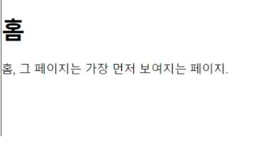

# 5주차 React 스터디 정리

| 장   | 제목                                 |
| ---- | ------------------------------------ |
| 13장 | 리액트 라우터로 SPA 개발하기         |
| 14장 | 외부 API를 연동하여 뉴스 뷰어 만들기 |




## 13장

### 13.1 SPA란?

참고: https://www.huskyhoochu.com/what-is-spa/


📍 Single Page Application

- 말 그대로 <u>한 개의 페이지</u>로 이루어진 애플리케이션


- 과거) 문서 하나에 전달되는 파일의 용량이 적음 → 어떤 요소를 클릭 시 완전히 새로운 페이지(html)를 **서버**에서 전송 

- 그러나 **요즘은?**

  점차 웹 사이트가 고도화됨 → 한 페이지에 해당하는 페이지 용량이 커짐 → 매번 새로운 페이지를 전달하는 것이 버거워지게 됨 (성능상의 문제)


위의 문제를 해결하기 위해 등장한 것이 `SPA` !


리액트 같은 라이브러리 혹은 프레임워크를 사용해서 뷰 렌더링을 ```사용자의 브라우저``` 가 담당하도록 하고, 우선 불러와서 실행시킨 후에 사용자가 뭔가를 `클릭` 하거나 `스크롤` 하면 상호작용하기 위한 최소한의 요소만 자바스크립트를 이용하여 업데이트 해 줌.


📍 라우팅: 다른 주소에 다른 화면을 보여주는 것

우리가 사용할 것은 여러 리액트 라우팅 라이브러리 중 가장 역사가 길고 사용 빈도가 높은 `리액트 라우터`


📍 SPA의 **단점**)

- 앱의 규모가 커지면 자바스크립트 파일이 너무 커진다는 것

  (페이지 로딩 시 사용자가 실제로 방문하지 않을 수도 있는 페이지의 스크립트도 불러오기 때문

  → 추후 코드 스플리팅을 배우면 개선 가능)

- 자바스크립트를 실행하지 않는 일반 크롤러에서는 페이지의 정보를 제대로 수집해 가지 못함.
- 자바스크립트가 실행될 때까지 페이지가 비어 있기 때문에, js 파일이 로딩되어 실행되는 짧은 시간 동안 흰 페이지가 나타날 수도 있음.

 (나중에 배우게 될 서버 사이드 렌더링을 통해 해결 가능)


### 13.2 프로젝트 준비 및 기본적인 사용법

1. 프로젝트 생성 후 라이브러리 설치

   ```yarn add react-router-dom```

2. 프로젝트에 라우터 적용

   src/index.js 파일

   ``` javascript
   import React from 'react';
   import ReactDOM from 'react-dom';
   import {BrowserRouter} from 'react-router-dom';
   import './index.css';
   import App from './App';
   
   ReactDOM.render(
     <BrowserRouter>
   	<App />
     </BrowserRouter>,
     document.getElementById('root')
   );
   ```

   📌~~import * as serviceWorker from './serviceWorker';~~

   ~~serviceWorker.unregister();~~

   리액트의 최신 버전에서는 serviceWorker가 이제 기본 제공되지 않아 에러 발생.

   serviceWorker를 참조하는 코드를 모두 지워주면 해결 !

   

3. 페이지 만들기

   Home.js (웹 사이트의 맨 처음)

```react
import React from 'react';

const Home = () => {
    return (
    <div>
        <h1>홈</h1>
        <p>홈, 그 페이지는 가장 먼저 보여지는 페이지.</p>
        </div>
    );
};

export default Home;
```


About.js (웹 사이트 소개)

```react
import React from 'react';

const About = () => {
    return (
    <div>
        <h1>소개</h1>
        <p>이 프로젝트는 리액트 라우터 기초를 실습해 보는 예제 프로젝트입니다.</p>
        </div>
    );
};

export default About;
```


4. Route 컴포넌트로 특정 주소에 컴포넌트 연결

   사용자의 현재 경로에 따라 다른 컴포넌트를 보여줘 봅시다.

   어떤 규칙을 가진 경로에 어떤 컴포넌트를 보여 줄지 정의할 수 있음.

   

   예시) `<Route path="주소규칙" component={보여 줄 컴포넌트} />`

   App.js

   ```javascript:App.js
   import React from "react";
   import { Route } from "react-router-dom";
   import About from "./About";
   import Home from "./Home";
   
   const App = () => {
     return (
       <div>
         <Route path="/" component={Home} />
         <Route path="/about" component={About} />
       </div>
     );
   };
   
   export default App;
   ```

   ​											localhost:3000


   ​					

   ​						localhost:3000/about


   /about 경로로 들어가도 home 컴포넌트까지 같이 등장해버림.

   /about 경로가 / 규칙에도 일치하기 때문에 발생한 현상 !

   

   🎃 Home을 위한 Route 컴포넌트를 사용할 때 exact라는 props를 true로 설정.

   exact 라는 props가 있을 경우, 주어진 경로와 정확히 맞아 떨어져야만 설정한 컴포넌트를 보여주게 됨! 

   `<Route path="/" component={Home} exact={true} />` 요렇게 

   

   

5. Link 컴포넌트를 사용하여 다른 주소로 이동하기

   - Link 컴포넌트: 말 그대로 클릭하면 다른 주소로 이동시켜 주는 친구

   우리가 일반 웹 애플리케이션에서 사용하던 a 태그를 리액트 라우터에서 사용하게 되면?

   페이지 전환 과정에서 페이지를 새로 불러옴 → 앱이 들고 있던 상태 모두 날림 (렌더링된 컴포넌트들도 모두 사라져요)

   📍 Link 컴포넌트를 사용하여 페이지를 전환하면, a 태그와 다르게 HTML5 History API를 사용하여 `페이지의 주소만` 변경해 줌.

   HTML5 History API) 서버로 요청을 전달하지 않고, 자바스크립트 영역에서 history api를 통해 현재 페이지 내에서 화면 이동이 일어난 것처럼 작동하게 함.

   예시) `<Link to="주소">내용</Link>`

   App.js

   ```react
   import React from "react";
   import { Route, Link } from "react-router-dom";
   import About from "./About";
   import Home from "./Home";
   
   const App = () => {
     return (
       <div>
         <ul>
           <li>
             <Link to="/">홈</Link>
           </li>
           <li>
             <Link to="/about">소개</Link>
           </li>
         </ul>
         <Route path="/" component={Home} exact={true} />
         <Route path="/about" component={About} />
       </div>
     );
   };
   
   export default App;
   
   ```


### 13.3 Route 하나에 여러 개의 path 설정하기

이번 절에 해당하는 내용은 최신 버전의 리액트 라우터 v5부터 적용된 기능


- 이전 버전) Route를 두 번 사용

```react
<Route path="/about" component={About} />
<Route path="/info" compontne={About} />
```


- 최신 버전) path props를 배열로 설정

```react
import React from "react";
import { Route, Link } from "react-router-dom";
import About from "./About";
import Home from "./Home";

const App = () => {
  return (
    <div>
      <ul>
        <li>
          <Link to="/">홈</Link>
        </li>
        <li>
          <Link to="/about">소개</Link>
        </li>
      </ul>
      <Route path="/" component={Home} />
      <Route path={["/about", "/info"]} component={About} />
    </div>
  );
};

export default App;

```

http://localhost:3000/info 


### 13.4 URL 파라미터와 쿼리

페이지 주소를 정의할 때, 유동적인 값을 사용해야 하는 상황에서 `파라미터`와 `쿼리`라는 선택지가 있음. 무조건 따라야 하는 규칙은 없지만, 아래의 상황 참고하기 !


- **파라미터**: 특정 아이디 혹은 이름을 사용하여 조회할 때 사용

  `/profile/velopert`

- **쿼리**: 어떤 키워드를 검색하거나 페이지에 필요한 옵션을 전달할 때 사용

  `/about?details=true`


1. URL 파라미터

   뒷부분에 유동적인 username 값을 넣어 줄 때, 해당 값을 props로 받아 와서 조회.

   Profile.js

   ```react
   import React from "react";
   
   const data = {
     hyunsung: {
       name: "김현성",
       description: "리액트 왕초보 개발자",
     },
     gildong: {
       name: "홍길동",
       description: "고전 소설 홍길동전의 주인공",
     },
   };
   
   const Profile = ({ match }) => {
     const { username } = match.params;
     const profile = data[username];
     if (!profile) {
       return <div>존재하지 않는 사용자입니다.</div>;
     }
     return (
       <div>
         <h3>
           {username}({profile.name})
         </h3>
         <p>{profile.description}</p>
       </div>
     );
   };
   
   export default Profile;
   ```

   라우트로 사용되는 컴포넌트에서 받아 오는 match라는 객체 안의 params 값을 참조함.

   (현재 컴포넌트가 어떤 경로 규칙에 의해 보이는지에 대한 정보가 들어있음.)

   

   App.js

   ```react
   import React from "react";
   import { Route, Link } from "react-router-dom";
   import About from "./About";
   import Home from "./Home";
   import Profile from "./Profile";
   
   const App = () => {
     return (
       <div>
         <ul>
           <li>
             <Link to="/">홈</Link>
           </li>
           <li>
             <Link to="/about">소개</Link>
           </li>
           <li>
             <Link to="/profile/hyunsung">hyunsung 프로필</Link>
           </li>
           <li>
             <Link to="/profile/gildong">gildong 프로필</Link>
           </li>
         </ul>
         <Route path="/" component={Home} exact={true} />
         <Route path={["/about", "/info"]} component={About} />
         <Route path="/profile/:username" component={Profile} />
       </div>
     );
   };
   
   export default App;
   ```

   이번 라우트의 path 규칙에 `/profile/:username`라고 넣어주면, match.params.username 값을 통해 현재 username 값을 조회할 수 있음. 

   


2. URL 쿼리

   이번에는 About 페이지에서 쿼리를 받아올 건데, 쿼리는 `location 객체`에 들어 있는 `search` 값에서 조회 가능.

   `location`객체는 웹 애플리케이션의 현재 주소에 대한 정보를 지니고 있음.

   

   http://localhost:3000/about?detail=true 주소로 들어갔을 때의 location 객체 값

   ```
   {
     "pathname": "/about",
     "search": "?detail=true",
     "hash": ""
   }
   ```

   문자열 형태로 되어있는 search 값에서 특정 값을 읽어 오기 위해서는 객체 형태로 변환해 주어야 함.

   `yarn add qs`를 입력하여 쿼리 문자열을 객체로 변환하는 qs 라이브러리 설치

   About.js

   ```react
   import React from "react";
   import qs from "qs";
   
   const About = ({ location }) => {
     const query = qs.parse(location.search, {
       ignoreQueryPrefix: true, // 이 설정을 통해 문자열 맨 앞의 ?를 생략
     });
     const showDetail = query.detail === "true";
     return (
       <div>
         <h1>소개</h1>
         <p>이 프로젝트는 리액트 라우터 기초를 실습해 보는 예제 프로젝트입니다.</p>
         {showDetail && <p>detail 값을 true로 설정하셨군요 ~!</p>}
       </div>
     );
   };
   
   export default About;
   ```

   - ignoreQueryPrefix: true // *이 설정을 통해 문자열 맨 앞의 ?를 생략*

   - const showDetail = query.detail === 'true'; // 쿼리의 파싱 결과 값은 문자열

     


### 13.5 서브 라우트

- 서브 라우트: 라우트 내부에 또 라우트를 정의하는 것

고냥 라우트로 사용되고 있는 컴포넌트의 내부에 Route 컴포넌트를 또 사용하면 됩니당.


Profiles.js

```react
import React from "react";
import { Link, Route } from "react-router-dom";
import Profile from "./Profile";

const Profiles = () => {
  return (
    <div>
      <h3>사용자 목록:</h3>
      <ul>
        <li>
          <Link to="/profiles/velopert">velopert</Link>
        </li>
        <li>
          <Link to="/profiles/gildong">gildong</Link>
        </li>
      </ul>

      <Route
        path="/profiles"
        exact
        render={() => <div>사용자를 선택해 주세요.</div>}
      />
      <Route path="/profiles/:username" component={Profile} />
    </div>
  );
};

export default Profiles;
```

- render={() => <div>사용자를 선택해 주세요.</div>} // 컴포넌트 자체를 전달하는 것이 아니라, 보여 주고 싶은 JSX를 넣어 줄 수 있음. 

- 만약, JSX에서 props를 설정할 때 값을 생략하면 자동으로 true로 설정 됨.

  // exact 라고만 적을 경우, exact = {true} 와 같은 의미임.


App.js

```react
import React from "react";
import { Route, Link } from "react-router-dom";
import About from "./About";
import Home from "./Home";
import Profile from "./Profile";
import Profiles from "./Profiles";

const App = () => {
  return (
    <div>
      <ul>
        <li>
          <Link to="/">홈</Link>
        </li>
        <li>
          <Link to="/about">소개</Link>
        </li>
        <li>
          <Link to="/profiles">프로필</Link>
        </li>
      </ul>
      <Route path="/" component={Home} exact={true} />
      <Route path={["/about", "/info"]} component={About} />
      <Route path="/profiles" component={Profiles} />
    </div>
  );
};

export default App;
```


### 13.6 리액트 라우터 부가 기능

1. history

   - history 객체: 라우트로 사용된 컴포넌트에 match, location과 함께 전달되는 props 중 하나
   - 컴포넌트 내에 구현하는 메서드에서 라우터 API를 호출할 수 있음.
   - ex) 특정 버튼 클릭 시 뒤로 가기, 로그인 후 화면 전환 등

   HistorySample.js

   ```react
   import React, { Component } from "react";
   
   class HistorySample extends Component {
     // 뒤로 가기
     handleGoBack = () => {
       this.props.history.goBack();
     };
   
     //홈으로 이동
     handleGoHome = () => {
       this.props.history.push("/");
     };
   
     componentDidMount() {
       // 이것을 설정하고 나면 페이지에 변화가 생기려고 할 때마다 정말 나갈 것인지를 질문
       this.unblock = this.props.history.block("정말 떠나실 건가요?");
     }
   
     componentWillUnmount() {
       // 컴포넌트가 언마운트되면 질문을 멈춤
       if (this.unblock) {
         this.unblock();
       }
     }
   
     render() {
       return (
         <div>
           <button onClick={this.handleGoBack}>뒤로</button>
           <button onClick={this.handleGoHome}>홈으로</button>
         </div>
       );
     }
   }
   
   export default HistorySample;
   ```

   App.js

   ```react
   import React from "react";
   import { Route, Link } from "react-router-dom";
   import About from "./About";
   import Home from "./Home";
   import Profiles from "./Profiles";
   import HistorySample from "./HistorySample";
   
   const App = () => {
     return (
       <div>
         <ul>
           <li>
             <Link to="/">홈</Link>
           </li>
           <li>
             <Link to="/about">소개</Link>
           </li>
           <li>
             <Link to="/profiles">프로필</Link>
           </li>
           <li>
             <Link to="/history">History 예제</Link>
           </li>
         </ul>
         <Route path="/" component={Home} exact={true} />
         <Route path={["/about", "/info"]} component={About} />
         <Route path="/profiles" component={Profiles} />
         <Route path="/history" component={HistorySample} />
       </div>
     );
   };
   
   export default App;
   ```

   

   

   

2. withRouter

   - withRouter 함수: HoC(Higher-order Component)임. 
   - Hoc란? 고차 컴포넌트로, 컴포넌트 로직을 재사용하기 위한 React의 고급 기술. (https://ko.reactjs.org/docs/higher-order-components.html) 
   - 라우트로 사용된 컴포넌트가 아니어도 match, location, history 객체를 접근할 수 있게 해줌.

   WithRouterSample.js

   ```react
   import React from "react";
   import { withRouter } from "react-router-dom";
   
   const WithRouterSample = ({ location, match, history }) => {
     return (
       <div>
         <h4>location</h4>
         <textarea
           value={JSON.stringify(location, null, 2)}
           rows={7}
           readOnly={true}
         />
         <h4>match</h4>
         <textarea
           value={JSON.stringify(match, null, 2)}
           rows={7}
           readOnly={true}
         />
         <button onClick={() => history.push("/")}>홈으로</button>
       </div>
     );
   };
   
   export default WithRouterSample;
   ```

   - withRouter 를 사용할 때는 컴포넌트를 내보내 줄 때 함수로 감싸 주기.
   - JSON.stringify의 두, 세번째 파라미터를 null, 2로 설정해 주면 들여쓰기가 적용된 상태로 문자열이 만들어짐.

   

   Profiles.js

   ```react
   import React from "react";
   import { Link, Route } from "react-router-dom";
   import Profile from "./Profile";
   import WithRouterSample from "./WithRouterSample";
   
   const Profiles = () => {
     return (
       <div>
         (...)
         <WithRouterSample />
       </div>
     );
   };
   
   export default Profiles;
   
   ```

   

   - match 객체의 params가 비어있는데, **withRouter**를 사용하면 **현재 자신을 보여 주고 있는 라우트 컴포넌트 (Profiles) 를 기준**으로 match가 전달됨.
   - 우리가 Profiles를 위한 라우트를 설정할 때 path="/profiles" 라고만 입력했으므로 username 파라미터를 읽어 오지 못하는 것임.
   - WithRouterSample 컴포넌트를 Profiles에서 지우고, Profile 컴포넌트에 넣으면 해결 !

   Profile.js

   ```react
   import React from "react";
   import { withRouter } from "react-router-dom";
   import WithRouterSample from "./WithRouterSample";
   
   (...)
   
   const Profile = ({ match }) => {
     const { username } = match.params;
     const profile = data[username];
     if (!profile) {
       return <div>존재하지 않는 사용자입니다.</div>;
     }
     return (
       <div>
         (...)
         <WithRouterSample />
       </div>
     );
   };
   
   export default withRouter(Profile);
   
   ```

   

   

3. Switch

   - 이 컴포넌트는 여러 Route를 감싸서 그중 일치하는 단 하나의 라우트만을 렌더링 시켜줌.
   - Switch를 사용하면, 모든 규칙과 일치하지 않을 때 보여 줄 Not Found 페이지도 구현할 수 있음.

   App.js

   ```react
   import React from "react";
   import { Route, Link, Switch } from "react-router-dom";
   import About from "./About";
   import Home from "./Home";
   import Profiles from "./Profiles";
   import HistorySample from "./HistorySample";
   
   const App = () => {
     return (
       <div>
         <ul>
           <li>
             <Link to="/">홈</Link>
           </li>
           <li>
             <Link to="/about">소개</Link>
           </li>
           <li>
             <Link to="/profiles">프로필</Link>
           </li>
           <li>
             <Link to="/history">History 예제</Link>
           </li>
         </ul>
         <Switch>
           <Route path="/" component={Home} exact={true} />
           <Route path={["/about", "/info"]} component={About} />
           <Route path="/profiles" component={Profiles} />
           <Route path="/history" component={HistorySample} />
           <Route
             // path를 따로 정의하지 않으면 모든 상황에 렌더링됨
             render={({ location }) => (
               <div>
                 <h2>이 페이지는 존재하지 않습니다:</h2>
                 <p>{location.pathname}</p>
               </div>
             )}
           />
         </Switch>
       </div>
     );
   };
   
   export default App;
   
   ```

   

   

4. NavLink

   - Link 와 비슷한 친구

   - 현재 경로와 Link에서 사용하는 경로가 일치하는 경우 특정 스타일 혹은 CSS 클래스를 적용할 수 있는 컴포넌트

   - 링크가 활성화되었을 때의 스타일을 적용할 때는 activeStyle 값을, 

     CSS 클래스를 적용할 때는 activeClassName 값을 props로 넣어 주면 됨.

   Profiles.js

   ```react
   import React from "react";
   import { NavLink, Route } from "react-router-dom";
   import Profile from "./Profile";
   
   const Profiles = () => {
     const activeStyle = {
       background: "black",
       color: "white",
     };
     return (
       <div>
         <h3>사용자 목록:</h3>
         <ul>
           <li>
             <NavLink activeStyle={activeStyle} to="/profiles/hyunsung">
               hyunsung
             </NavLink>
           </li>
           <li>
             <NavLink activeStyle={activeStyle} to="/profiles/gildong">
               gildong
             </NavLink>
           </li>
         </ul>
   	
             (...)
       </div>
     );
   };
   
   export default Profiles;
   ```

   


### 13.7 정리

- 큰 규모의 프로젝트를 진행하다 보면, 여러 요소들이 쌓이며 최종 결과물인 자바스크립트 파일의 **크기가 매우 커지는 문제**가 발생
- 라우트에 따라 필요한 컴포넌트만 불러오고, 다른 컴포넌트는 해당 시점에 불러오면 더 효율적일 것!
- 이는 19장에 나올 코드 스플리팅에서 다시 언급


## 14장

### 14.1 비동기 작업의 이해

웹 애플리케이션을 만들다가 보면, 서버의 API를 사용하는 등 처리에 시간이 걸리는 작업이 있음.

네트워크 송수신 과정에서 시간이 소요되기 때문에, 작업을 즉시 처리하지 않고 응답 받을 때까지 기다렸다가 전달받은 응답 데이터를 처리함. 

### 

📍 비동기적으로 처리한다면, 웹 애플리케이션이 멈추지 않기 때문에 **동시에 여러 가지 요청을 처리**할 수도 있고, **기다리는 과정에서 다른 함수도 호출**할 수 있음.

```react
function printMe() {
    console.log('Hello World!');
}
setTimeout(printMe, 3000); // 3초 후에 printMe 함수 호출
console.log('대기 중 ...');
```

- setTimeout 함수를 사용해서 특정 작업을 예약할 때도 작업을 비동기적으로 처리함.
- 위의 코드는 3초 후에 printMe 함수(콜백함수)를 호출하는데, 이 때 전체코드가 아예 3초동안 멈추는게 아니라 콜백함수만 멈춘다고 생각하면 쉬움 !


```react
function increase(number, callback) {
    setTimeout(() => {
        const result = number + 10;
        if (callback) {
            callback(result);
        }
    }, 1000)
}

increase(0, result => {
    console.log(result);
});
```

파라미터 값이 주어지면 1초 뒤에 10을 더해서 반환하는 함수가 있고, 콜백 함수를 활용해서 해당 함수가 처리된 직후 결과값을 출력하는 코드.


- 만약, 1초에 걸쳐서 10, 20, 30, 40과 같은 형태로 여러 번 순차적으로 처리하고 싶다면 콜백함수를 중첩하여 구현할 수 있음.

  ```react
  console.log('작업 시작');
  increase(0, result => {
      console.log(result);
      increase(result, result => {
      	console.log(result);
          increase(result, result => {
      		console.log(result);
              increase(result, result => {
      			console.log(result);
                  console.log('작업 완료');
              });
          });
      });
  })
  ```

  🚨 단, **콜백지옥** 오픈


📍 **Promise**는 콜백 지옥을 벗어나게 도와주는 기능.

- 여러 작업을 연달아 처리한다고 해서 함수를 여러 번 감싸는 것이 아니라 `.then` 을 사용해서 그 다음 작업을 설정하기 때문에 콜백 지옥 형성 X.

  ```react
  function increase(number) {
      const promise = new Promise((resolve, reject) => {
          // resolve는 성공, reject는 실패
          setTimeout(() => {
              const result = number + 10;
              if (result > 50) {
                  // 50보다 높으면 에러 발생시키기
                  const e = new Error('NumberTooBig');
                  return reject(e);
              }
              resolve(result); // number 값에 +10 후 성공 처리
          }, 1000);
      });
      return promise;
  }
  
  increase(0)
  .then(number => {
      // Promise에서 resolve된 값은 .then을 통해 받아 올 수 있음
      console.log(number);
      return increase(number); // Promise를 리턴하면
  })
  .then(number => {
      // 또 .then으로 처리 가능
      console.log(number);
      return increase(number);
  })
  .then(number => {
      console.log(number);
      return increase(number);
  })
  .then(number => {
      console.log(number);
      return increase(number);
  })
  .then(number => {
      console.log(number);
      return increase(number);
  })
  .catch(e => {
      // 도중에 에러가 발생한다면 .catch를 통해 알 수 있음
      console.log(e);
  });
  ```

  

📍 **async / await**

- Promis를 더욱 쉽게 사용할 수 있도록 해 주는 문법.
- 함수의 앞부분에 async 키워드를 추가하고, 해당 함수 내부에서 Promise의 앞부분에 await 키워드를 사용하면 Promise가 끝날 때까지 기다리고, 결과 값을 특정 변수에 담을 수 있음.

```react
function increase(number) {
    // 위와 동일
}

async function runTasks() {
    try { // try/catch 구문을 사용하여 에러를 처리.
        let result = await increase(0);
        console.log(result);
        result = await increase(result);
        console.log(result);
        result = await increase(result);
        console.log(result);
        result = await increase(result);
        console.log(result);
        result = await increase(result);
        console.log(result);
        result = await increase(result);
        console.log(result);
    } catch (e) {
        console.log(e);
    }
}
```


### 14.2 axios로 API 호출해서 데이터 받아 오기

- axios는 현재 가장 많이 사용되고 있는 자바스크립트 HTTP 클라이언트로,

  HTTP 요청을 Promise 기반으로 처리함.


프로젝트 생성 후, axios 추가

`yarn add axios`


App.js

```react
import React, { useState } from 'react';
import axios from 'axios';

const App = () => {
  const [data, setData] = useState(null);
  const onClick = () => {
    axios
      .get('https://jsonplaceholder.typicode.com/todos/1')
      .then((response) => {
        setData(response.data);
      });
  };
  return (
    <div>
      <div>
        <button onClick={onClick}>불러오기</button>
      </div>
      {data && (
        <textarea
          rows={7}
          value={JSON.stringify(data, null, 2)}
          readOnly={true}
        />
      )}
    </div>
  );
};

export default App;
```

- onClick 함수에서 사용한 axios.get 함수는 파라미터로 전달된 주소에 GET 요청을 해주고, 그 결과는 .then을 통해 비동기적으로 확인할 수 있음.

  


App.js (위 코드에 async 적용한 코드)

```react
import React, { useState } from 'react';
import axios from 'axios';

const App = () => {
  const [data, setData] = useState(null);
  const onClick = async () => {
    try {
      const response = await axios.get(
        'https://jsonplaceholder.typicode.com/todos/1',
      );
      setData(response.data);
    } catch (e) {
      console.log(e);
    }
  };
  return (
    <div>
      <div>
        <button onClick={onClick}>불러오기</button>
      </div>
      {data && (
        <textarea
          rows={7}
          value={JSON.stringify(data, null, 2)}
          readOnly={true}
        />
      )}
    </div>
  );
};

export default App;
```

- 화살표 함수에 async/await를 적용할 때는 async () => {} 와 같은 형식으로 적용.


### 14.3 newsapi API 키 발급받기

이번 프로젝트에서 newsapi에서 제공하는 API를 사용하여 최신 뉴스를 불러온 후 보여줄 것이기 때문에, 사전에 newsapi에서 API 키를 발급받아야 함.

`https://newsapi.org/register/` 요기 가입하면 발급받을 수 있음 !

(가입 후 발급받은 API 키는 추후 API를 요청할 때 API 주소의 쿼리 파라미터로 넣어서 사용하면 됨.)


`https://newsapi.org/s/south-korea-news-api` 요기는 한국 뉴스 가져오는 API에 대한 설명 !


우리가 사용할 API 주소는 ✌가지 형태 (apiKey부분에는 발급받았던 키 입력하면 됨.)

1. 전체 뉴스 불러오기

   GET https://newsapi.org/v2/top-headlines?country=kr&apiKey=6cdb71d9626a43a7a70d09defddc844d

2. 특정 카테고리 뉴스 불러오기

   GET https://newsapi.org/v2/top-headlines?country=kr&category=business&apiKey=6cdb71d9626a43a7a70d09defddc844d


위의 App.js 의 JSONPlaceholder 가짜 API를 전체 뉴스를 불러오는 API로 대체하면,


데이터 잘 나타나는 거 확인 가능합니당


### 14.4 뉴스 뷰어 UI 만들기

이제 데이터를 화면에 예쁘게 보여주기 위해, 

styled-components를 사용하여 뉴스 정보를 보여 줄 컴포넌트를 만들어 보겠어요.


styled-components 설치

`yarn add styled-components`


src 디렉터리 안에 componenets 디렉터리 생성 → NewsItem.js와 NewsList.js 파일 생성


각 뉴스 데이터가 지니고 있는 정보로 이루어진 JSON 객체

```json
{
    "source": {
        "id": null,
        "name": "Donga.com"
    },
    "author": null,
    "title": ""새 집 냄새" "주택 청약 고마워!" …이시언 아파트 공개 - 동아일보",
    "description": "배우 이시언(37)이 자신의 새 아파트를 공개했다. 이시언은 25일 방송한 MBC 예능 '나 혼자 산다'에서 정든 옛집을 떠나 새 아파트로 이사했다. 이사한 아파트에 도착한 …",
    "url": "http://news.donga.com/Main/3/all/20190126/93869524/2",
    "urlToImage": "http://dimg.donga.com/a/600/0/90/5/wps/NEWS/IM-AGE/2019/01/26/93869523.2.jpg",
    "publishedAt": "2019-01-26T00:21:00Z",
    "content": null
}
```


NewsItem.js (각 뉴스 정보를 보여 주는 컴포넌트)

```react
import React from "react";
import styled from 'styled-components';

const NewsItemBlock = styled.div`
    display: flex;
    .thumbnail {
        margin-right: 1rem;
        img {
            display: block;
            width: 160px;
            height: 100px;
            object-fit: cover;
        }
    }
    .contents {
        h2 {
            margin: 0;
            a {
                color: black;
            }
        }
        p {
            margin: 0;
            line-height: 1.5;
            margin-top: 0.5rem;
            white-space: normal;
        }
    }
    & + & {
        margin-top: 3rem;
    }
`;
const NewsItem = ({ article }) => {
    const {title, description, url, urlToImage} = article;
    return (
        <NewsItemBlock>
            {urlToImage && (
                <div className="thumbnail">
                    <a href={url} target="_blank" rel="noopener noreferrer">
                        
                    </a>
                </div>
            )}
            <div className="contents">
                <h2>
                    <a href={url} target="_blank" rel="noopener noreferrer">
                        {title}
                    </a>
                </h2>
                <p>{description}</p>
            </div>
        </NewsItemBlock>
    );
};    

export default NewsItem;
```


NewsList.js (API를 요청하고, 뉴스 데이터가 들어 있는 배열을 컴포넌트 배열로 변환하여 렌더링해 주는 컴포넌트) - 아직 데이터 안불러왔으므로, 가짜 내용이 보이게 함.

```react
import React from 'react';
import styled from 'styled-components';
import NewsItem from './NewsItem';

const NewsListBlock = styled.div`
  box-sizing: border-box;
  padding-bottom: 3rem;
  width: 768px;
  margin: 0 auto;
  margin-top: 2rem;
  @media screen and (max-width: 768px) {
    width: 100%;
    padding-left: 1rem;
    padding-right: 1rem;
  }
`;

const sampleArticle = {
  title: '제목',
  description: '내용',
  url: 'htps://google.com',
  urlToImage: 'https://via.placeholder.com/160',
};

const NewsList = () => {
  return (
    <NewsListBlock>
      <NewsItem article={sampleArticle} />
      <NewsItem article={sampleArticle} />
      <NewsItem article={sampleArticle} />
      <NewsItem article={sampleArticle} />
      <NewsItem article={sampleArticle} />
      <NewsItem article={sampleArticle} />
    </NewsListBlock>
  );
};

export default NewsList;
```


App.js 에 NewsList만 렌더링해서 보여주게 되면, 요렇게 컴포넌트들이 잘 나타난 모습 확인 가능.


------

