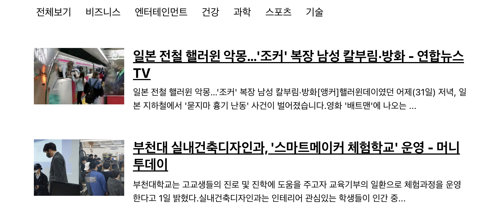

# 5주차 React 스터디 정리

## 개인이 만든 템플릿입니다! 템플릿이 올라오면 수정 예정

| 장   | 제목                         |
| ---- | ---------------------------- |
| 14장 | 리액트 라우터로 SPA 개발하기 |
| 15장 | Recoil 연습                  |

## 14장

### 14.5 데이터 연동하기

📍NewsList 컴포넌트에서 이전에 사용했던 API를 호출해보자

- 이때 useEffect를 사용하여 컴포넌트가 처음 렌더링 되는 시점에 API를 요청
- useEffect에 등록하는 함수에 async를 붙이면 안됨
- useEffect에서 반환해야 하는 값은 뒷정리 함수이기 때문
- 따라서 useEffect 내부에서 async/await를 사용하고 싶다면, 함수 내부에 async 키워드가 붙은 또 다른 함수를 만들어서 사용해 주어야 함
- 요청이 대기 중일 때는 loading 값이 true가 되고, 요청이 끝나면 Loading 값이 false가 되어야 함

```javascript:components/NewsList.js
import React, {useState, useEffect} from 'react';
import styled from 'styled-components';
import NewsItem from './NewsItem';
import axios from 'axios';

const NewsListBlock = styled.div`
    box-sizing: border-box;
    padding-bottom: 3rem;
    width: 768px;
    margin: 0 auto;
    margin-top: 2rem;
    @media screen and (max-with: 768px){
        width: 100%;
        padding-left: 1rem;
        padding-right: 1rem;

    }
    `;


    const NewsList=()=>{
        const [articles, setArticles] = useState(null);
        const [loading, setLoading] = useState(false);

        useEffect(()=> {
            //async를 사용하는 함수 따로 선언
            const fetchData = async () => {
                setLoading(true);
                try{
                    const response = await axios.get(
                        'https://newsapi.org/v2/top-headlines?country=kr&apiKey=c33d47e154f7420dba0b22bc0f01c941'
                    );
                    setArticles(response.data.articles);
                }catch(e){
                    console.log(e);
                }
                setLoading(false);
            };
            fetchData();
        },[]);

        if(loading){
            return <NewsListBlock>대기 중.....</NewsListBlock>
        }
        if(!articles){
            return null;
        }
        return(
            <NewsListBlock>
                {articles.map(article =>(
                    <NewsItem key={article.url} article={article}/>
                ))}
            </NewsListBlock>
        );
    };

    export default NewsList;
```


- map 함수를 사용하기 전에 꼭 !articles를 조회하여 해당 값이 현재 null이 아닌지 검사해야함.
- 이 작업을 하지 않으면, 아직 데이터가 없을 때 null에는 map함수가 없기 때문에 렌더링 과정에서 오류가 발생

### 14.6 카테고리 기능 구현하기

❗뉴스의 카테고리 선택기능을 구현해보자

📍 카테고리 선택 UI 만들기

```javascript: components/Categories.js
import React from 'react';
import styled from 'styled-components';

const categories = [
    {
        name: 'all',
        text: '전체보기'

    },
    {
        name: 'business',
        text: '비즈니스'
    },
    {
        name: 'entertainment',
        text: '엔터테인먼트'
    },
    {
        name: 'health',
        text: '건강'
    },
    {
        name: 'science',
        text: '과학'
    },
    {
        name: 'sports',
        text: '스포츠'
    },
    {
        name: 'technology',
        text: '기술'
    }
];

const CategoriesBlock = styled.div`
    display: flex;
    padding: 1rem;
    width: 768px;
    margin: 0 auto;
    @media screen and (max-width: 768px){
        width: 100%;
        overflow-x: auto;
    }
`;

const Category = styled.div`
    font-size: 1.125rem;
    cursor: pointer;
    white-space: pre;
    text-decoration: none;
    color: inherit;
    padding-bottom: 0.25rem;

    &:hover{
        color: #495057;
    }

    & + & {
        margin-left: 1rem;
    }
    `;

    const Categories = () => {
        return (
            <CategoriesBlock>
                {categories.map(c=>(
                    <Category key={c.name}>{c.text}</Category>
                ))}
            </CategoriesBlock>
        );
    };

export default Categories;
```

-위 코드에서는 catagories 라는 배열 안에 name과 text값이 들어가 있는 객체들을 넣어 주어서 한글로 된 카데고리와 실제 카데고리 값을 연결시켜 줌

- name은 실제 카데고리 값, text값은 렌더링할 때 사용할 한글 카데고리를 가리킴



❗이제 App에서 category 상태를 useState로 관리해보자

- 추가로 category 값을 업데이트하는 onSelect라는 함수도 만들어주자
- 그리고 category와 onSelect 함수를 Categories 컴포넌트에게 props로 전달하기
- Category 값을 NewsList 컴포넌트에게도 전달해주어야 함

```javascript:components/Categories.js
import React from 'react';
import styled, {css} from 'styled-components';

const categories = [
    {
        name: 'all',
        text: '전체보기'

    },
    {
        name: 'business',
        text: '비즈니스'
    },
    {
        name: 'entertainment',
        text: '엔터테인먼트'
    },
    {
        name: 'health',
        text: '건강'
    },
    {
        name: 'science',
        text: '과학'
    },
    {
        name: 'sports',
        text: '스포츠'
    },
    {
        name: 'technology',
        text: '기술'
    }
];

const CategoriesBlock = styled.div`
    display: flex;
    padding: 1rem;
    width: 768px;
    margin: 0 auto;
    @media screen and (max-width: 768px){
        width: 100%;
        overflow-x: auto;
    }
`;

const Category = styled.div`
    font-size: 1.125rem;
    cursor: pointer;
    white-space: pre;
    text-decoration: none;
    color: inherit;
    padding-bottom: 0.25rem;

    &:hover{
        color: #495057;
    }

    ${props=>
    props.active && css`
    font-weight: 600;
    border-bottom: 2px solid #22b8cf;
    color: #22b8cf;
    &:hover{
        color: #3bc9db;
    }
`}

    & + & {
        margin-left: 1rem;
    }
    `;

    const Categories = ({onSelect, category}) => {
        return (
            <CategoriesBlock>
                {categories.map(c=>(
                    <Category
                    key={c.name}
                    active={category === c.name}
                    onClick={()=> onSelect(c.name)}
                    >
                    {c.text}
                    </Category>
                ))}
            </CategoriesBlock>
        );
    };

export default Categories;
```

📍API 호출할 때 카테고리 지정하기

```javascript: components/NewsList.js
import React, {useState, useEffect} from 'react';
import styled from 'styled-components';
import NewsItem from './NewsItem';
import axios from 'axios';

const NewsListBlock = styled.div`
    box-sizing: border-box;
    padding-bottom: 3rem;
    width: 768px;
    margin: 0 auto;
    margin-top: 2rem;
    @media screen and (max-with: 768px){
        width: 100%;
        padding-left: 1rem;
        padding-right: 1rem;

    }
    `;


    const NewsList=({category})=>{
        const [articles, setArticles] = useState(null);
        const [loading, setLoading] = useState(false);

        useEffect(()=> {
            //async를 사용하는 함수 따로 선언
            const fetchData = async () => {
                setLoading(true);
                try{
                    const query = category === 'all'? '':`&category=${category}`;
                    const response = await axios.get(
                        'https://newsapi.org/v2/top-headlines?country=kr${query}&apiKey=c33d47e154f7420dba0b22bc0f01c941'
                    );
                    setArticles(response.data.articles);
                }catch(e){
                    console.log(e);
                }
                setLoading(false);
            };
            fetchData();
        },[category]);

        if(loading){
            return <NewsListBlock>대기 중.....</NewsListBlock>
        }
        if(!articles){
            return null;
        }
        return(
            <NewsListBlock>
                {articles.map(article =>(
                    <NewsItem key={article.url} article={article}/>
                ))}
            </NewsListBlock>
        );
    };

    export default NewsList;
```

-> 오류 발생

### 14.7 리액트 라우터 적용하기

### 14.8 usePromise 커스텀 Hook 만들기

## 15장(Recoil 대체)

### 소개 - 동기

### 소개 - 주요 개념

#### Atoms

#### Selectors

### 소개 - 설치

### 소개 - Recoil 시작하기

### 기본 자습서 - 도입부

### 기본 자습서 - Atoms

### 기본 자습서 - Selectors
