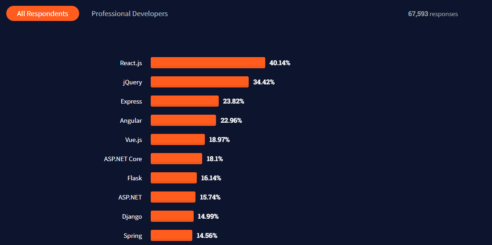
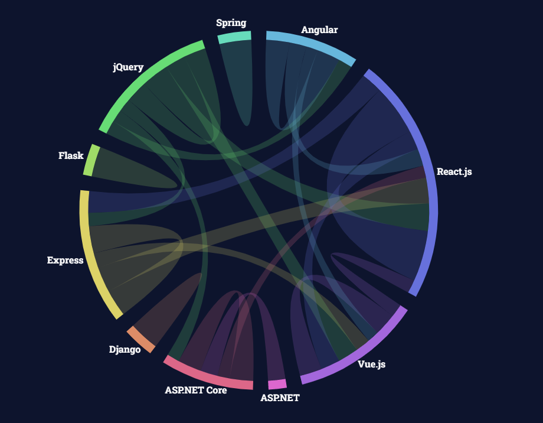
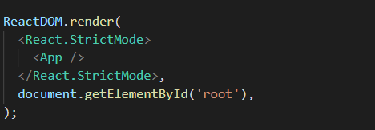
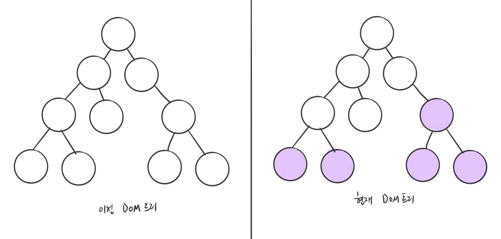
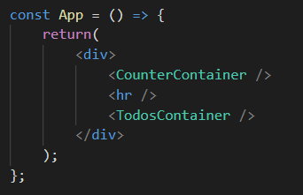
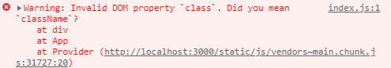

# 1주차 React 스터디 정리

| 장   | 제목          |
| ---- | ------------- |
| 1장  | 리액트의 시작 |
| 2장  | JSX           |
| 3장  | 컴포넌트      |

## 들어가기에 앞서

리액트는 2021년 현재 프론트엔드에서 가장 유명하고 많이 사용하는 프레임워크입니다

실제로 최대 프로그래밍 커뮤니티 사이트인 Stack Overflow의 2021년 통계를 보면 리액트가 얼마나 많은 사람들이 사용하고 많은 프로그래머들이 같이 일하기를 원하는지 알 수 있습니다





좀 더 자세한 내용은 [여기에서 보실 수 있습니다](https://insights.stackoverflow.com/survey/2021#technology-most-popular-technologies)

## `1장`

### 왜 리액트인가

기존 자바스크립트는 모델 데이터를 조회, 수정한 것을 뷰에 반영하려 할때 어떤 부분을 찾아서 변경할지 규칙을 정하는 일이 있었습니다

이런 규칙은 간단해보이지만 규모가 커지면 상당히 복잡해지고 때에 따라 성능저하가 발생하기도 했었습니다

페이스북 팀은 이런 규칙을 정하는 것이 아닌 뷰를 다 날려버리고 새로 렌더링 하는 방식을 개발했는데 이게 리액트입니다

이렇게하면 어떤 변화를 줄지 신경 쓸 필요가 없고 규칙에 때라 새로 렌더링하면 됩니다


### 리액트 이해

- 리액트는 `View`만 신경쓰는 라이브러리입니다

```
보통 프레임워크는 각각 Model, View, Contorl을 뜻하는 MVC 패턴을 가지고 있지만 리액트는 오직 `View`만 관리하면 됩니다
```

- 컴포넌트란?

```
특정 부분이 어떻게 생길지 정하는 선언체를 `컴포넌트(Component)`라고 합니다

컴포넌트의 가장 큰 장점은 페이지를 여러개로 나눠 재사용 가능하게 만들어줍니다
```
```javascript
// 메인페이지
const Home = () => {
  {/* 페이지 구성을 여러개로 나눠 재사용할 수 있다 */}
  <Header />
  <Postings />
  <Footer />
};

export default Home;
```

- `초기 랜더링`과 `리랜더링`

```
사용자 화면에 보여 주는 것을 렌더링이라고 합니다

리액트는 렌더링 방식으로 두 가지가 있는데 컴포넌트가 최초로 실행한 `초기 렌더링`과 데이터 변경으로 다시 실행되는 `리렌더링`이 있습니다
```

### 초기 렌더링

리액트의 초기 렌더링은 다음의 과정을 거칩니다
```
렌더링 함수 발생 → HTML 마크업 → 실제 페이지의 DOM에 주입 → 페이지 렌더링 끝
```
아래는 실제 리액트 프로젝트의 `index.js`에서 사용되는 render 함수입니다



### 조화 과정

뷰를 업데이트 하는 과정을 `조화 과정` 이라고 합니다

업데이트를 하는 것 처럼 보이지만 실제로는 변화가 필요한 부분을 다 날리고 render 함수를 통해 다시 렌더링하게 됩니다


### 리액트의 특징

리액트의 특징 중 하나는 Virtual DOM을 사용하는 것입니다

! 여기서는 DOM에 대해서는 자세히 다루지 않겠습니다 DOM에 대한 내용은 [여기를 참고해주세요](https://ko.wikipedia.org/wiki/%EB%AC%B8%EC%84%9C_%EA%B0%9D%EC%B2%B4_%EB%AA%A8%EB%8D%B8)

### Virtual DOM

```
Virtual DOM은 이름 그대로 DOM을 추상화한 JS 객체를 구성해 사용합니다. 이를 통해 더 가볍게 DOM을 이용할 수 있게 됩니다

리액트에서 데이터가 변해 실제 DOM에 업데이트하는 과정은 '조화 과정'에 설명한 부분과 같습니다
```

### 기타 특징

```
오직 View만 제공하기에 라우팅이나 비동기 처리, 상태 관리를 기본 지원하지 않습니다

하지만 라우팅은 리액트 라우터, 비동기 처리에는 axios, 상태 관리에는 recoil등 상황에 맞는 라이브러리를 사용해 이런 문제를 해결할 수 있습니다
```

### 작업 환경 설정

### 기본 프로그램 설치

- [Node.js](https://nodejs.org/en/)
- [yarn](https://yarnpkg.com/)
- [Visual Studio Code](https://code.visualstudio.com/)
- [Git](https://git-scm.com/)

macOS 를 사용중이시라면 아래 명령어로 모든 것들을 해결하실 수 있습니다.

```shell
brew install node && brew install yarn && brew install --cask visual-studio-code && brew install git
```
⚠️ macOS 사용자 분들중에 homebrew를 모르신다면 [여기](https://subicura.com/mac/)를 참고해주세요!

### 프로젝트 생성하기

```shell
yarn create react-app (project-name)
```

### 프로젝트 실행하기

```shell
(project-name 폴더로 이동 후)
yarn start
```

## `2장`

### 웹팩
리액트에서는 import를 통해 모듈들을 불러와 사용할 수 있습니다

```javascript
import React from 'react';
import someMoudle from 'modulePath'
```

여기서 알아야 할 점은 원래 브라우저에서 모듈 import를 지원하지 않습니다 이 기능은 `Node.js`에서 지원하는 기능입니다

이런 기능을 브라우저에서 사용하기 위해 `번들러`를 사용하는데 대표적으로는 webpack 이라는 도구가 있습니다. 웹팩에 대한 내용은 아직 다루지 않겠습니다

### JSX



프로젝트를 실행하고 App.js 파일의 return 부분을 보면 HTML과 유사한 코드를 볼 수 있습니다

이는 HTML이 아닌 JSX라고 하며 자바스크립트의 확장 문법입니다

#### JSX의 장점

- 보기 쉽고 익숙합니다
```
HTML과 유사한 작성법이기에 익숙합니다
```
- 활용도가 높습니다

```
JSX에서는 HTML 문법을 쓸 수 있을 뿐더러 컴포넌트도 작성할 수 있습니다
```

#### JSX의 문법

- 여러 컴포넌트를 작성한다면 반드시 부모 요소로 감싸야합니다
```javascript
// 에러! 여러 컴포넌트를 가지고 있지만 이를 감싸주는 부모 요소가 없다
const App = () => {
    return(
        <CounterContainer />
        <hr />
        <TodosContainer />
    );
};
```
```javascript
// 올바른 작성법
const App = () => {
    return(
        <div>
            <CounterContainer />
            <hr />
            <TodosContainer />
        </div>
    );
};

// 혹은 이렇게도 가능합니다
const App = () => {
    return(
        <> {/* 또는 <Fragement> 요소로 감싸도 됨 */}
            <CounterContainer />
            <hr />
            <TodosContainer />
        </>
    );
};
```

- 자바스크립트 표현은 `{ }`
```javascript
const App = () => {
    const name = 'myName'
    return(
        <div>
            <h1>나의 이름은</h1>
            {name}
        </div>
    );
};
```

- if문 대신 조건부 연산자

[자바스크립트의 조건부 연산자](https://developer.mozilla.org/ko/docs/Web/JavaScript/Reference/Operators/Conditional_Operator)
```javascript
const App = () => {
    const name = 'myName'
    return(
        <div>
            {name === 'myName' ? (
                <h1>올바른 이름</h1>
            ):(
                <h1>틀린 이름</h1>
            )}
        </div>
    );
};
```
만약 조건이 `True`일때만 렌더링을 하고 싶다면 `&&`
```javascript
const App = () => {
    const name = 'myName'
    return(
        <div>
            {name === 'myName' && <h1>올바른 이름</h1>}
        </div>
    );
};
```

- undefined 값만 반환해 렌더링하는 상황을 만들면 안됩니다
(단, JSX 내부에서 undefined를 렌더링하는건 괜찮습니다)
```javascript
// 에러! undefined 값을 리턴함
const App() => {
  const name = undefined
  return name
}
```
```javascript
// JSX 내부에서는 가능합니다
const App() => {
  const name = undefined
  return <div>name</div>
}
```

- 값이 undefined일 수도 있다면 `||`
```javascript
const App() => {
  const name = undefined
  return name || 'name is undefined'
}
```

- 인라인 스타일링

DOM 요소에 스타일을 적용하려면
1. 객체형태로 넣어줍니다
2. 카멜 표기법으로 작성합니다

이 부분은 추후 Sass 혹은 styled-component 등을 사용하므로 넘어가겠습니다

- class 대신 className
```javascript
// 에러!
const App() => {
  return <div class='myClass'></div>
}
```
```javascript
// class 대신 className
const App() => {
  return <div className='myClass'></div>
}
```
리액트 16버전부터는 class를 써도 정상적으로 작동은 되지만 다음과 같은 메시지가 발생하게됩니다


- 태그는 꼭 닫자

원래 HTML에서는 닫는 태그가 없어도 작동되는 태그가 있습니다 예를들어 `<br>` `<hr>` `<input>`가 그런 경우입니다

하지만 리액트에서는 꼭 닫는 태그가 있어야합니다 `<br />` `<input />`처럼요


- JSX 내에서 주석은 `{/*  */}`


### ESLint와 Prettier 적용하기
혼자 코딩을 하면 괜찮지만 협업을 하는 경우 코딩 스타일이 달라 혼란이 생길 수도 있습니다

이를 해결하기 위해 ESLint와 Prettier를 적용하는데 각각 문법 검사 도구, 코드 스타일 자동 정리 도구입니다

이 둘을 설치하지 않았다면 VS code 마켓에서 설치해주세요

만약 리액트 문법을 어기게 된다면 `ESLint`가 밑줄과 함께 에러 메시지를 표시할 것입니다

`Prettier`를 사용하려면 `F1`을 누르고 `format`을 입력후 `Enter`를 누르세요

이 둘은 규칙을 세팅할 수 있는데 추후 프로젝트에서 세팅을 하게 될수도 있습니다

## `3장`

컴포넌트를 작성하는 방법에는 `클래스형 컴폰넌트`와 `함수형 컴포넌트`가 있습니다

### 클래스형 컴포넌트

```javascript
import React, { Component } from 'react';

class App extends Component {
  render() {
    const name = 'react';
    return <div className='react'>{name}</div>
  }
}

export default App;
```
클래스 컴포넌트의 경우 `state`와 `라이프사이클`을 사용할 수 있다는 것과 임의 메서드를 정의할 수 있다는 특징이 있습니다

클래스형 컴포넌트의 경우 최근에는 잘 쓰지 않는 방식입니다 실제로 리액트 공식 문서에서는 함수형 컴포넌트를 권장하고 있고요

[왜 리액트는 함수형 컴포넌트를 추천할까요](https://reactjs.org/docs/hooks-intro.html#gradual-adoption-strategy)

### 함수형 컴포넌트

함수형 컴포넌트의 장점
- 클래스형 컴포넌트보다 선언하기가 편하다
- 메모리 소스도 덜 사용한다
- 빌드 후 배포시 결과물의 파일 크기가 더 작다

단점
- state와 라이프사이클 API 사용 불가능하다 (이부분은 Hooks로 해결 가능합니다)

### 컴포넌트 생성하는법

- src 폴더에 (ComponentName).js (주의! 컴포넌트명은 반드시 첫 글자는 대문자로 시작해야합니다)

- 코드 작성
 
```javascript
// 최신 버전의 리액트에서는 이 부분 생략 가능
import React from 'react';

const MyComponent = () => {
  return <div>hello new Component!</div>
};

// 컴포넌트 이름과 일치시키기
export default MyComponent;
```

Tip) 함수형 컴포넌트는 `function`으로 쓰는 방법과 `화살표 함수`를 쓰는 방법이 있습니다

화살표 함수에 관한 설명은 [여기를 참고해주세요](https://developer.mozilla.org/ko/docs/Web/JavaScript/Reference/Functions/Arrow_functions)

### 작성한 컴포넌트를 불러오기

```javascript
import React from 'react';
import MyComponent from './MyComponent';

const App = () => {
  return <MyComponent />;
};

export default App;
```

### props

#### `props`는 간단하게 부모 컴포넌트로부터 설정되어 넘어온 값입니다

props는 읽기 전용으로만 사용 가능합니다 때문에 props를 바꾸려면 부모 컴포넌트에서 값을 바꿔줘야합니다

```javascript
// App.js
const App = () => {
  {/* props로 name이라는 파라미터를 넘겨줌 */}
  return <MyComponent name='React' />;
};

// MyComponent.js
const MyComponent = props => {
  {/* props를 받아와 표시한다 */}
  return <div>hi my name is {props.name}</div>
};
```

#### 기본 props 값을 `defaultProps`을 통해 설정 할 수 있습니다

```javascript
const MyComponent = props => {
  return <div>hi my name is {props.name}</div>
};

// 기본 props값
MyComponent.defaultProps = {
  name: 'default name'
}
```

#### 태그 사이 내용을 보여주는 `children`

컴포넌트 사이의 내용을 props를 `children`통해 보여줄 수 있습니다
```javascript
const App = () => {
  return <MyComponent>이게 바로 칠드런</MyComponent>;
};

// MyComponent
const MyComponent = () => {
  return <div>children 값은 {props.children}입니다!</div>;
};
```

#### 비구조화 할당으로 props 다루기

[비구조화 할당? : 객체에서 값을 추출하는 문법](https://developer.mozilla.org/ko/docs/Web/JavaScript/Reference/Operators/Destructuring_assignment)

props 값을 조회할 때마다 `props.` 키워드를 쓰는게 불편할 때가 있습니다

이 키워드는 비구조화 할당 문법을 통해 간단하게 props를 다룰 수 있습니다

```javascript
const MyComponent = props => {
  // 비구조화 할당
  const { name, children } = props;
  return (
    {/* props. 키워드 없이 쓸 수 있다 */}
    <div>
      hi my name is {name} <hr /> children is {children}
    </div>
  );
};
```

#### propTypes를 통한 props 검증

필수 props를 지정하거나 타입을 지정할 때 `propTypes`를 사용합니다

```javascript
// propTypes 불러오기
import PropTypes from 'prop-types';

const MyComponent = props => {
  return (...)
};

// PropTypes 지정
MyComponent.propTypes = {
  // name은 반드시 string 형태여야 한다
  name: PropTypes.string
  
  // 특정 props 필수 지정
  myAge: PropTypes.number.isRequired
};
```

### state
`state`는 컴포넌트 내부에서 바뀔 수 있는 값입니다

함수형 컴포넌트 기준 state를 다루는 대표적인 방법으로 `useState`라는 Hooks가 있습니다

```javascript
// useState를 사용하기 위해서는 해당 Hooks를 불러와야합니다
import { useState } from 'react;

const Say = () => {
  // 첫번쨰 인자: state 값, 두번쨰 인자: state를 세팅해주는 세터함수
  // useState 내부에는 초기값을 설정해줍니다
  const [message, setMessage] = useState('');
  
  // 이벤트 핸들러
  // 해당 이벤트 함수에 따라 message가 변하게된다
  const onClickEnter = () => setMessage('안녕하세요!');
  const onClickLeave = () => setMessage('안녕히 가세요!');
  
  // JSX
  return (
    <div>
      <button onClick={onClickEvent}>입장</button>
      <button onClick={onClickLeave}>퇴장</button>
      <h1>{message></h1>
    </div>
  );
};
```

#### state를 사용할 때 주의 사항

state 값을 바꾸려면 `세터함수`를 사용해 값을 변경해야합니다

```javascript
const [message, setMessage] = useState('hello world!');

// 잘못된 state 값 변경
message = 'hi react!'

// 세터 함수를 사용해 state 변경
setMessage('안녕하세요!');
```

#### 객체, 배열에서 값을 변경하려면 `사본`을 만들어 변경해야합니다

사본을 만드는 방법은 자바스크립트 [ES6 문법](https://velog.io/@bu_du_dak/filter-map-spread) 을 사용해야합니다

특히, 아래 `map` `filter`, 추가로 `reduce` 등의 사용법은 꼭 숙지하길 추천합니다

리액트에서 state를 다루면서 많이 사용할 것이고 최근 트랜드인 [함수형 프로그래밍](https://deveric.tistory.com/107) 에서 쓰는 대표적 함수이기 때문입니다

````javascript
// 객체의 값 업데이트
const object = {a: 1, b: 2, c: 3};
const nextObject = {...object, b: 5}; // object 사본을 spread 문법으로 복사 후 b값만 업데이트

// 배열
const arr = [
  { id: 1, value: true },
  { id: 2, value: true },
  { id: 3, value: false },
];

let nextArr = arr.concat({id: 4}); // concat으로 배열 사본 만든 후 항목 추가

nextArr.filter(item => item.id !== 2); // id가 2가 아닌 나머지를 반환 (즉, id가 2인 항목을 제거)

// map을 통해 모든 nextArr 값(item)을 돌면서 item의 id가 1이라면 value를 false로 설정
nextArr.map(item => (item.id === 1 ? {...item, value: false } : item);

````
